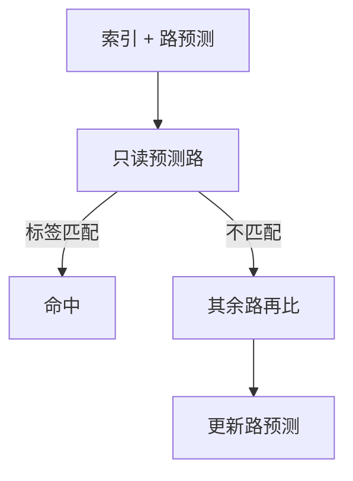

# 路预测

组相联每拍读出所有路再比较标签，费能量；用 PC 或地址的低位猜哪一路，猜中则只启用那一路的数据阵列。

<footer>—— 据 Powell et al.；Inoue 等对 way-predicting cache 的工作；Hennessy and Patterson, CA:AQA 整理</footer>

[上一课](/cs/cache-aliasing) 保证一组之内至多一份物理行。[VIPT](/cs/vipt-cache) 仍要在命中路径上比较 $n$ 路标签。L1 每拍都访问，功耗与 SRAM 读口成了限制频率的因素。本课不重做别名探测。缺口是**路预测：先猜一路，错了再并行重试。**

## 问题

8 路 L1D：标签小、数据宽，读 8 份 64B 再扔掉 7 份。真并行保证单周期命中，但能量按路数涨。许多访问的路随 PC 或最近历史稳定（循环扫同一数组走同一路模式）。缺口不是减路变成直接映射（冲突会回来），而是**用小表预测 way 号，命中路径只激活一路**。

猜错：多一拍变成「先错后全相联比较」，平均命中延迟略升。L1 对延迟敏感，所以预测必须很准，或仅用于指令 cache / L2。

## 方法

路预测表：用 VA 或 PC 索引，存上次命中的 way。并行仍算标签（可只读预测路的标签+数据）。命中且 way 对：完成。way 错或标签不匹配：下一拍读其余路或全组，更新预测表。

指令 cache 的路更可预测（顺序取指），L1I 常用；L1D 要更谨慎。

## 机制

这是用平均延迟换平均能量，对 [CPI](/cs/cpi-amdahl) 的影响是命中项从 1 拍变成 $1+p_{\text{mis}}\times$ 惩罚。与分支预测不同：错路不会冲刷 ROB，只是 cache 多一拍。别名处理之后 way 号才稳定；着色失败会导致 way 表学乱。

## 边界

本课不把牺牲缓存当成路预测：牺牲缓存是直接映射冲突的旁路，下一课。也不把预测器做成 ISA 可见。伪相联（先读一路再读另一路）是路预测的近亲，可当作 way 数为 2 的特例。

后课默认：相联度的能量可以用猜路来砍。直接映射加一个全相联小缓冲，是另一条减冲突的路。

## 小结

- 路预测少读数据阵列，猜错只加命中延迟、不冲刷。
- L1I 通常比 L1D 更适合猜路。
- 直接映射的冲突用牺牲缓存补，是下一课。
- 出处：way-predicting cache 文献；Hennessy and Patterson, *CA:AQA*。
