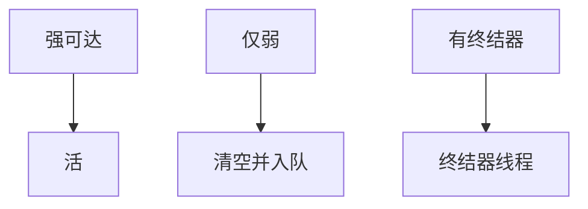

# 弱引用与终结器

弱引用不阻止回收；回收后队列通知缓存失效。终结器在对象不可达后跑用户代码，次序与及时性几乎无法保证，容易复活与死锁。

<footer>—— 据 Java Reference 与 Finalizer 规范；Jones 手册；Boehm 对终结器的警告整理</footer>

上一课[TLAB](/cs/bump-allocation-tlab) 把对象生出来。缺口是**非强可达**：Weak/Soft/Phantom、终结器。语言特性落地课序下一课从闭包转换开始；本课收束内存管理。主干 GC 未细讲弱。

## 问题

缓存：希望条目随对象死。弱引用：GC 发现只有弱到达则可清并把引用入队。终结器：`finalize` 在回收前调用，对象可复活（再被强引用）。缺口是**可达性等级**，不是 bump。

现代语言倾向 `Cleaner`/显式 `Drop`，弱化终结器。

### 弱不是 Option 的 None

Option 是静态可能空；弱引用是动态被 GC 清空。可组合：`Option<Weak<T>>`。

Java 的 java.lang.ref。Boehm, Destructors, Finalizers, and Synchronization。Rust 无终结器，有 Drop。Jones 手册。

## 方法

GC 标记分阶段：强扫描后再处理弱。若对象未强达，清弱指针、入 ReferenceQueue。终结器：入终队列，单独线程跑，跑完再回收（或复活）。

与分代：弱引用处理在 minor/full 的时机不同，实现复杂。

## 机制

终结器线程持锁+分配可死锁、可饿死。及时性：内存压力大才跑。不要用终结器关文件；用显式作用域。弱哈希表要处理清队列。

安全：终结器里看的对象字段可能半构造——语言规则。

## 边界

本课不写所有引用类型。后课默认：弱引用服务缓存；终结器尽量不用。下一课闭包转换：从堆对象到函数表示。

也不把弱当密码学弱密钥。

## 小结

- 弱引用不保持对象；队列做通知。
- 终结器不可靠、可复活，应用层应显式释放。
- GC 须分阶段处理引用强度。
- 出处：Java Reference API；Boehm；Jones 手册。
