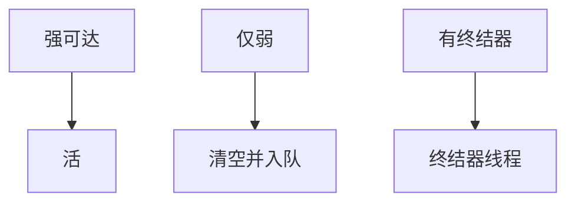
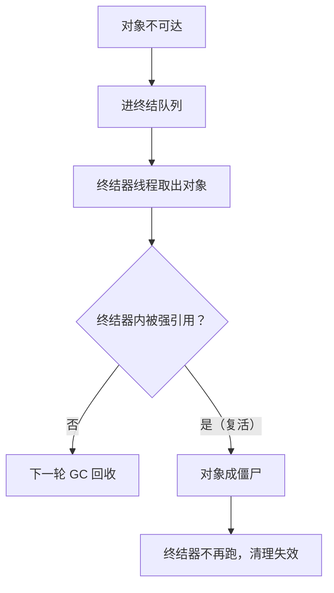

# 弱引用与终结器

弱引用不阻止回收；回收后队列通知缓存失效。终结器在对象不可达后跑用户代码，次序与及时性几乎无法保证，容易复活与死锁。

<footer>—— 据 Java Reference 与 Finalizer 规范；Jones 手册；Boehm 对终结器的警告整理</footer>

上一课[TLAB](/cs/bump-allocation-tlab) 把对象生出来。缺口是**非强可达**：Weak/Soft/Phantom、终结器。语言特性落地课序下一课从闭包转换开始；本课收束内存管理。主干 GC 未细讲弱。

## 问题

缓存：希望条目随对象死。弱引用：GC 发现只有弱到达则可清并把引用入队。终结器：`finalize` 在回收前调用，对象可复活（再被强引用）。缺口是**可达性等级**，不是 bump。

术语翻译：弱引用就是「不阻止回收」的指针——GC 只沿强引用链判定生死，弱引用只负责事后收通知「它被清了」。缓存用它存条目，对象被别处持有时缓存有效，没人用时缓存自动让路。

现代语言倾向 `Cleaner`/显式 `Drop`，弱化终结器。

### 弱不是 Option 的 None

Option 是静态可能空；弱引用是动态被 GC 清空。可组合：`Option<Weak<T>>`。

Java 的 java.lang.ref。Boehm, Destructors, Finalizers, and Synchronization。Rust 无终结器，有 Drop。Jones 手册。

## 方法

GC 标记分阶段：强扫描后再处理弱。若对象未强达，清弱指针、入 ReferenceQueue。终结器：入终队列，单独线程跑，跑完再回收（或复活）。

```mermaid
flowchart TD
  STR["强可达"] --> LIVE["活"]
  WEAK["仅弱"] --> CLR["清空并入队"]
  FIN["有终结器"] --> Q["终结器线程"]
```

与分代：弱引用处理在 minor/full 的时机不同，实现复杂。

## 机制

终结器线程持锁+分配可死锁、可饿死。及时性：内存压力大才跑。不要用终结器关文件；用显式作用域。弱哈希表要处理清队列。

为什么重要：终结器通常要等下一次 GC 才有机会跑，堆够用时可能一直不跑。假设进程上限 1024 个文件句柄，靠终结器关文件，很快就会撞上「Too many open files」——句柄是操作系统资源，不归堆管。

常见误区：以为对象进终结队列就一定会死——终结器里把 `this` 存进静态字段就能复活；复活后多数实现不会再跑第二次终结器，对象变成不再有清理机会的「僵尸」，非内存资源就这样漏掉。

```mermaid
flowchart TD
  D["对象不可达"] --> QF["进终结队列"]
  QF --> T["终结器线程取出对象"]
  T --> R{"终结器内被强引用？"}
  R -->|"否"| RECLAIM["下一轮 GC 回收"]
  R -->|"是（复活）"| ZOMB["对象成僵尸"]
  ZOMB --> AGAIN["终结器不再跑，清理失效"]
```

安全：终结器里看的对象字段可能半构造——语言规则。

## 边界

本课不写所有引用类型。后课默认：弱引用服务缓存；终结器尽量不用。下一课闭包转换：从堆对象到函数表示。

也不把弱当密码学弱密钥。

## 小结

- 弱引用不保持对象；队列做通知。
- 终结器不可靠、可复活，应用层应显式释放。
- GC 须分阶段处理引用强度。
- 出处：Java Reference API；Boehm；Jones 手册。
