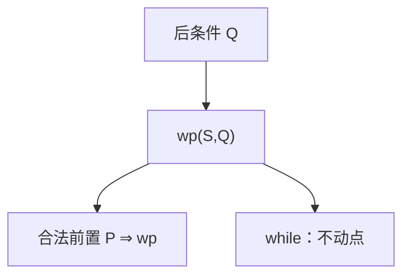

# 最弱前置条件

$\mathrm{wp}(S,Q)$ 是使 $S$ 执行后 $Q$ 成立的最弱前置。Dijkstra 用它定义语义：从后往前算，循环变成不动点。

<footer>—— 据 Dijkstra, A Discipline of Programming, 1976；Winskel 整理</footer>

上一课[Hoare 逻辑](/cs/hoare-logic) 的三元组要人提供 $P$ 与不变式。缺口是**最弱前置** $\mathrm{wp}(S,Q)$：$\{P\}S\{Q\}$ 部分正确当且仅当 $P\Rightarrow\mathrm{wp}(S,Q)$（在终止版本下还有「必停」）。本课给赋值、顺序、if 的等式；while 用 $\mu$。

## 问题

$\mathrm{wp}(x:=e,Q)=Q[e/x]$。$\mathrm{wp}(S_1;S_2,Q)=\mathrm{wp}(S_1,\mathrm{wp}(S_2,Q))$。$\mathrm{wp}(\mathrm{if}\ b\ S_1\ S_2,Q)=(b\land\mathrm{wp}(S_1,Q))\lor(\neg b\land\mathrm{wp}(S_2,Q))$。循环：$\mathrm{wp}(\mathrm{while}\ b\ S,Q)$ 是最弱的 $I$，满足 $I\iff(\neg b\land Q)\lor(b\land\mathrm{wp}(S,I))$——即某个单调变换的最弱不动点 / 最大前不动点，说法随部分/完全正确而变。本课要「循环 = 不动点方程」，计算下一课 Knaster–Tarski。

$\mathrm{sp}$（最强后置）从前往后，对符号执行更亲。点名。

### 最弱不是「最容易证」

最弱 $P$ 允许最多起始状态，公式可能更复杂。人写的不变式往往强于 $\mathrm{wp}$，但更好证。

Dijkstra 1976；谓词变换器。ESC/Java、Boogie 把 VC 生成建成工具，本课不写前端。完全正确的 wp 要求体降低变式。

## 方法

对无循环程序从后往前算一遍 $\mathrm{wp}$。指出循环必须近似不动点或给不变式当归纳假设。对照赋值公理：它正是 $\mathrm{wp}$ 的特例。

## 机制

验证条件生成：用户给不变式，工具检查体保持、进入、退出，即若干 $\mathrm{wp}$ 蕴含。SMT 后课吃这些公式。没有不变式则要对循环求不动点——有限域上即模型检验的前/后像，再后课。

可靠：谓词变换器与操作语义一致。

Dijkstra 的卫式命令：$\mathrm{wp}(S_0\square S_1,Q)=\mathrm{wp}(S_0,Q)\land\mathrm{wp}(S_1,Q)$ 当两条都可执行。魔命令 $\mathbf{abort}$ 的 wp 是假。循环的近似：从假迭代 $\Phi$ 得到最弱不变式的不足逼近，有限抽象域上会停。VC 生成把用户不变式当归纳假设，检查几条蕴含。

## 边界

本课不定义卫式命令全集，不引入概率 wp。不把抽象解释写完。后课默认：无环程序的 $P$ 可算；循环要不变式或不动点。下一课格上的 Knaster–Tarski。

无环程序的 $P$ 可从后往前算；循环变成谓词变换器的不动点。用户不变式是归纳假设，工具只检查蕴含。下一课用格定理保证最小/最大不动点存在。

上一课留下的缺口在本课收口；「最弱前置条件」进入后课词汇表后只引用。文献用来钉对象与边界，不把本课写成该主题的独立综述。

## 小结

- $\mathrm{wp}(S,Q)$ 是使后条件成立的最弱前置。
- 赋值、顺序、if 有等式；while 是不动点。
- Hoare 三元组 $=P\Rightarrow\mathrm{wp}$。
- 出处：Dijkstra, 1976；Winskel。
