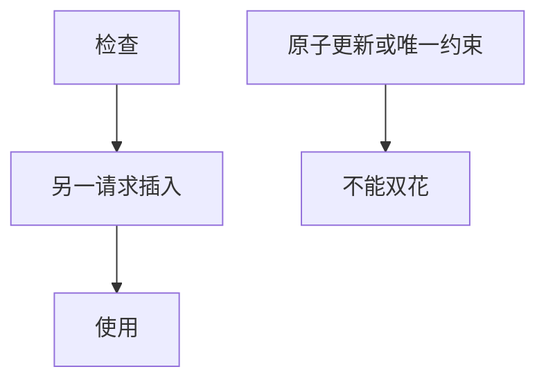

# Web 竞态

检查与使用若中间插入另一请求，优惠券、余额、一次性令牌就会被用两次。Web 的并发是多请求，不是只线程库。防御是原子更新与幂等键。

<footer>—— 据 CWE-362；对照[TOCTOU](/cs/toctou)</footer>

## 定位

上一课[XXE](/cs/xxe)是解析器。缺口是**时间**：主干 TOCTOU 已给文件竞态；本课落到 HTTP 处理。不给刷余额的操作指导。

后课默认已经读完本课钉下的合同，只补差，不从该领域第一性原理重开。

## 问题

先读余额再写，两请求交错。一次性标记非原子。缺口是：数据库约束、行锁、幂等键。

### 最终一致

跨服务无事务时要用幂等与对账，不能只靠应用层判断。

CWE-362。禁止利用竞态的步骤。业务逻辑下一课更广。

## 方法

用原子加减。令牌表唯一约束。下一课业务逻辑漏洞：授权与工作流。

图中节点是本课的机制骨架；课程不把图展开成可运行的攻击步骤。

## 机制

完整性：不变量在并发下失败。业务逻辑下一课即使单线程也会错。

前提写进合同之后，游戏外的误用只当失败模式点名，不在本课写成操作程序。

## 边界

不写并发 PoC。业务逻辑漏洞下一课。

## 小结

- XXE 是解析；竞态是检查与使用的间隙。
- 原子约束优于应用层判断。
- Web 并发等于并行请求。
- 下一课业务逻辑。
- 出处：CWE-362；[toctou](/cs/toctou)。
