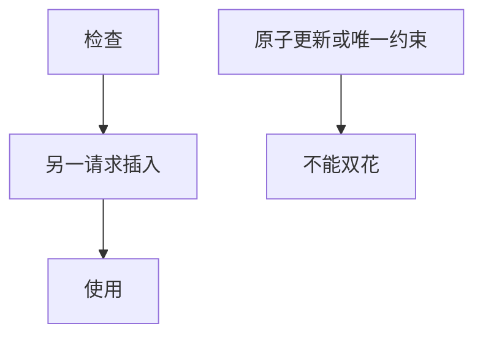
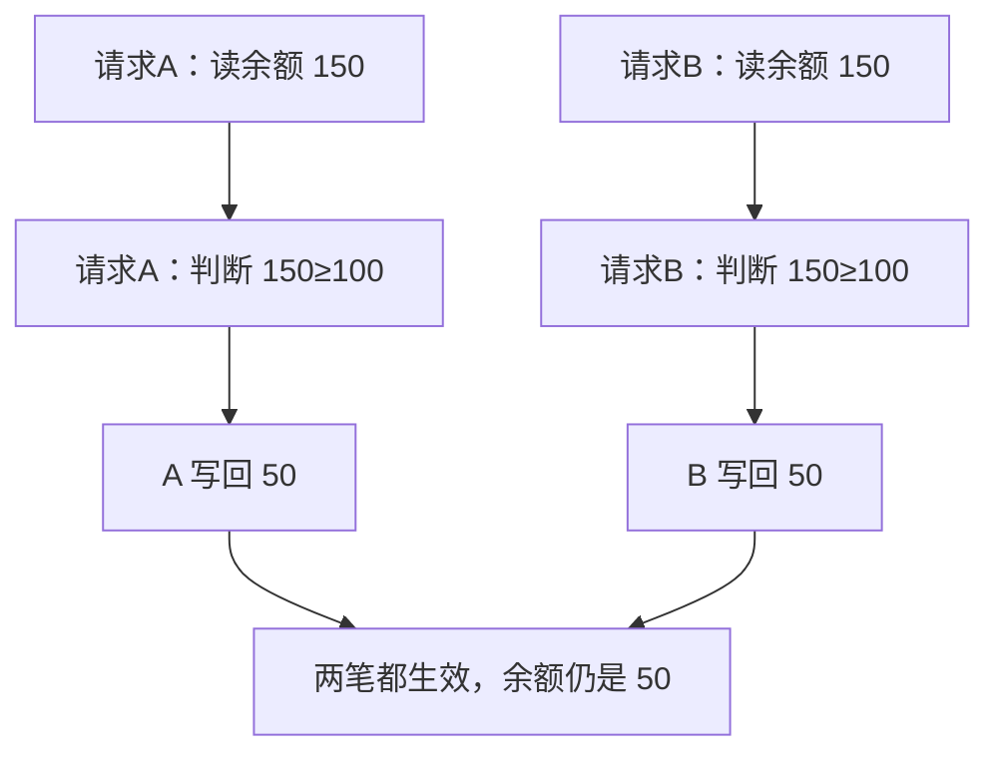

# Web 竞态

检查与使用若中间插入另一请求，优惠券、余额、一次性令牌就会被用两次。Web 的并发是多请求，不是只线程库。防御是原子更新与幂等键。

<footer>—— 据 CWE-362；对照[TOCTOU](/cs/toctou)</footer>

上一课[XXE](/cs/xxe)的病根在解析器；本课缺口是**时间**：主干 TOCTOU 课已给文件系统的竞态，这里落到 HTTP 请求处理。不给刷余额的操作指导。

后课默认已经读完本课钉下的合同，只补差，不从该领域第一性原理重开。

## 问题

典型形态：处理「扣 100 元」的代码先读余额、判断充足、再写回——两个并发请求都在对方写入前完成读取，一次扣款被执行两次或提现两次。一次性令牌同理：「检查用过没有」与「标记已用」是两条语句，中间就是窗口。缺口是三件：数据库层约束（CHECK、唯一索引）、行锁或条件更新（UPDATE ... WHERE balance >= 100）、幂等键让重试不产生第二次效果。

### 最终一致

跨服务没有分布式事务时，竞态窗口以秒计：只能靠幂等键加异步对账兜底，不能靠应用层的先后判断。

CWE-362。禁止利用竞态的步骤。业务逻辑下一课更广。

## 方法

方法是把判断压进原子操作：余额用单条条件更新，令牌用表上唯一约束让第二次插入直接失败，支付接口以幂等键去重。设计口号是「不变量交给存储引擎」，应用层代码不再自查并发。下一课业务逻辑漏洞：授权与工作流。

直觉类比：两个收银员同时看同一本账簿的同一页——各自看到「够扣」就各自记账，账就记重了；唯一约束相当于让账簿自己拒绝把第二笔记在同一编号上，谁后写谁失败。

```mermaid
flowchart TD
  CHK["检查"] --> GAP["另一请求插入"]
  GAP --> USE["使用"]
  ATOM["原子更新或唯一约束"] --> OK["不能双花"]
```

## 机制

机制定位在 CIA 的 I：每条不变量（余额非负、令牌一次性）在串行下成立，并发下检查与使用的间隙被另一请求插入，不变量即破。注意 Web 的并发单位是并行请求——用户双击、脚本重放、弱网重试都会自然产生并发，不需要专门工具。业务逻辑下一课：有些错即使单线程也会犯。

数字实例：余额 150 元，两个并发「扣 100」请求都读到 150、都判定够、都写回 50——串行正确结果应是一笔成功余额 50、另一笔被拒；竞态下两笔都成功且写回同一个 50，窗口就开在「判断」与「写回」之间。

```mermaid
flowchart TD
  A["请求A：读余额 150"] --> B["请求A：判断 150≥100"]
  C["请求B：读余额 150"] --> D["请求B：判断 150≥100"]
  B --> E["A 写回 50"]
  D --> F["B 写回 50"]
  E --> R["两笔都生效，余额仍是 50"]
  F --> R
```

## 边界

不写并发 PoC；边界要点名：分布式锁不是银弹——锁超时与锁服务自身的竞态都要进设计，最稳的锚是数据库约束这类绕不过的层。业务逻辑漏洞下一课。

常见误区：以为加了分布式锁就安全——锁有超时，持锁方一旦卡顿超时被强制释放，第二个请求就能拿到锁把同一段逻辑再跑一遍；锁只是缩小窗口，存储层约束才是绕不过的底线。

## 小结

- XXE 是解析；竞态是检查与使用的间隙。
- 原子约束优于应用层判断。
- Web 并发等于并行请求。
- 下一课业务逻辑。
- 出处：CWE-362；[toctou](/cs/toctou)。
