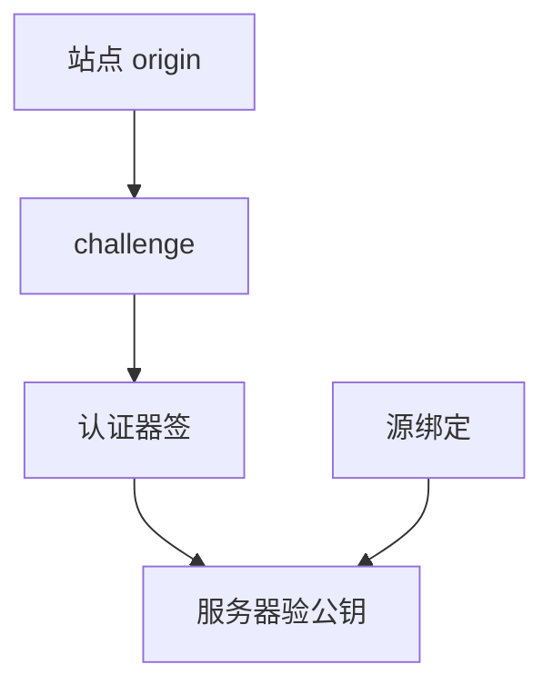

# WebAuthn / FIDO2

WebAuthn 让浏览器把挑战交给认证器：私钥不出盒，站点拿到的是源绑定的公钥凭证。钓鱼站点换源就验不过，这是对共享口令模型的结构性修补。

<footer>—— W3C Web Authentication；FIDO Alliance CTAP；对照 RFC 6238 仍只是第二因素</footer>

## 定位

上一课[SAML](/cs/saml)仍常与口令 IdP 搭配。缺口是**源绑定公钥**：凭据属于 `https://example.com`，不是用户可粘贴的秘密。本课收登记与断言，不写破解认证器的步骤。

后课默认已经读完本课钉下的合同，只补差，不从该领域第一性原理重开。

## 问题

口令可被钓鱼页收集。WebAuthn：RP ID、challenge、user verification、attestation（可选）。缺口是丢失设备与恢复流程——恢复若退回邮箱口令，钓鱼面回来。

### 不是生物识别本身

指纹/面容是认证器本地解锁。服务器只看见签名成功，不应存储生物模板。FAR/FRR 更后一课。

W3C WebAuthn Level 2/3。平台认证器与只安全密钥。本课不提供克隆密钥的指导。

## 方法

分 ceremony：create 与 get。强调 challenge 防重放、origin 由浏览器填。服务器存公钥与计数器（克隆检测点名）。对照 TOTP：仍是共享秘密，可被钓鱼同时转发。

图中节点是本课的机制骨架；课程不把图展开成可运行的攻击步骤。

## 机制

身份因素从「知道」转向「持有+本地解锁」。账户恢复、企业托管与备份密钥是治理，不是协议算术。下一课 TOTP 与 MFA：仍广泛部署的共享秘密第二因素。

前提写进合同之后，游戏外的误用只当失败模式点名，不在本课写成操作程序。

## 边界

本课不写 CTAP  hid 细节。TOTP 下一课。

## 小结

- SAML/OAuth 常仍站在口令上；WebAuthn 源绑定密钥。
- 私钥不出认证器；challenge 防重放。
- 恢复流程可能把钓鱼面请回来。
- 下一课 TOTP 与 MFA。
- 出处：W3C Web Authentication；FIDO CTAP；对照 RFC 6238。
