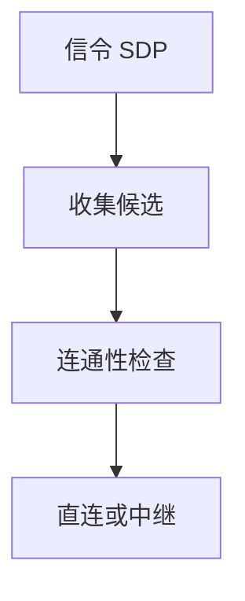

# WebRTC 与 ICE

浏览器直连音视频与数据：ICE 收集候选、连通性检查，选出能打通 NAT 的路径；媒体走 SRTP，信令另给。

<footer>—— 据 RFC 8445 ICE；RFC 8825 WebRTC 概览整理</footer>

[BT](/cs/bittorrent-dht) 要发现对等。[NAT](/cs/dhcp-nat) 挡直连。[上一课](/cs/bittorrent-dht) 不解决实时媒体。缺口是 **WebRTC + ICE**：候选、检查、与下一课 STUN/TURN 分工。本课不把 STUN 消息写完。

## 问题

通话要低延迟，不宜都走服务器中继（除非必要）。WebRTC：浏览器 API，ICE 把 host/srflx/relay 候选配对打连通性检查（STUN 绑定），同意一条。信令（SDP offer/answer）经你的 HTTPS 服务器，不规定死。媒体 DTLS-SRTP。与 QUIC 对照：都可 NAT 上的 UDP；ICE 更早。

不要把 ICE 写成 SDN 控制器。

RFC 8445。Trickle ICE 增量候选。本课钉对象。

### 信令与媒体分离

ICE 选能通的候选。尽量 P2P，失败才中继。没有信令通道则不能开始。对称 NAT 常要 TURN。

## 方法

画：收集候选 → 检查 → 选定。对照 SSH 转发：那是叠 TCP；ICE 尽量直连 UDP。与 MPTCP：多候选类似多径，选出后通常一条媒体路。

方法止于选定对象与对照；机制才说它如何嵌入已有分层与主干课。

## 机制

对称 NAT 失败则 TURN。企业防火墙禁 UDP 则全中继，延迟像卫星。拥塞：GCC/NACK 在媒体，不是 Reno 名。PTP 不需要。Cookie 会话在信令侧。

安全：DTLS 身份，防注入。不写扫描。

## 边界

本课不引入 simulcast 的全部。STUN/TURN 是下一课。后课默认：ICE 选路；媒体尽量 P2P。

没有信令通道，ICE 不能开始。

上一课留下的缺口在本课收口；「WebRTC 与 ICE」进入后课词汇表后只引用。文献用来钉对象与边界，不把本课写成该主题的独立综述。下一课[STUN / TURN](/cs/stun-turn)。

## 小结

- ICE 用候选与检查穿过 NAT。
- 信令与媒体分离。
- 失败才中继，延迟上升。
- 后课只引用本课钉死的对象，不从该领域总问题重开。
- 出处：RFC 8445；RFC 8825。
