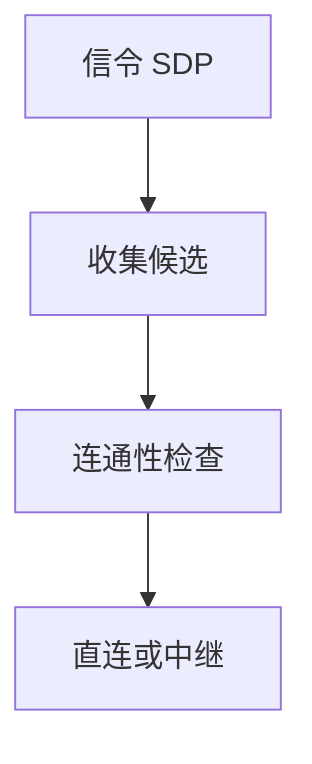

# WebRTC 与 ICE

浏览器直连音视频与数据：ICE 收集候选、连通性检查，选出能打通 NAT 的路径；媒体走 SRTP，信令另给。

<footer>—— 据 RFC 8445 ICE；RFC 8825 WebRTC 概览整理</footer>

[BT](/cs/bittorrent-dht)要发现对等，[NAT](/cs/dhcp-nat)挡在直连中间，而[上一课](/cs/bittorrent-dht)的发现不解决实时媒体的低延迟传输。缺口是 **WebRTC + ICE**：候选从哪来、怎么配对检查，以及与下一课 STUN/TURN 的分工。本课不把 STUN 消息格式写完。

## 问题

通话要低延迟，能直连就不该都压到服务器中继。WebRTC 给浏览器一组实时媒体 API；ICE 负责选路：收集 host（本机）、srflx（NAT 反射）、relay（中继）三类候选，两两配对发 STUN 绑定做连通性检查，同意一条路径。信令——SDP offer/answer 的交换——经你自己的 HTTPS 服务器，协议不规定实现。媒体走 DTLS-SRTP 加密。与 QUIC 对照：两者都跑在能穿 NAT 的 UDP 上；ICE 出现得更早，解决「选哪条路」而非「如何可靠传输」。

ICE 是两端协商，没有集中控制器，不要写成 SDN。

RFC 8445。Trickle ICE 增量候选。本课钉对象。

### 信令与媒体分离

分离是设计要点：ICE 只管选出能通的候选，媒体尽量 P2P，失败才中继；但没有信令通道交换候选与 SDP，ICE 根本不能开始。对称 NAT 对不同目的地换端口，srflx 候选对不上号，常要 TURN 兜底。

## 方法

流程三步：收集候选、配对检查、选定路径。对照 SSH 转发：那是叠加在 TCP 上的隧道；ICE 尽量直连 UDP，中继是最后选项。与 MPTCP 对照：多候选在表面积上类似多径，但 ICE 选定后通常只留一条媒体路径。

```mermaid
flowchart TD
  SIG["信令 SDP"] --> ICE["收集候选"]
  ICE --> CHK["连通性检查"]
  CHK --> P2P["直连或中继"]
```

## 机制

机制细节：对称 NAT 下连通性检查失败，转 TURN；企业防火墙禁 UDP 时走 TCP/TLS 中继，延迟明显抬升。拥塞控制在媒体栈内部——GCC 估带宽、NACK 重传——不是 TCP Reno 那一套。ICE 只管路径，精确时钟之类不需要。会话保持（Cookie 等）放在信令侧。

安全上，DTLS 指纹验证对端身份，防媒体注入；本课不写扫描与穿透操作。

## 边界

本课不引入 simulcast 的全部。STUN/TURN 是下一课。后课默认：ICE 负责选路，媒体尽量 P2P；没有信令通道，ICE 不能开始。

下一课[STUN / TURN](/cs/stun-turn)。

## 小结

- ICE 用候选配对与连通性检查穿过 NAT。
- 信令与媒体分离，信令通道自备。
- 直连失败才中继，延迟随之上升。
- 后课只引用本课钉死的对象，不从该领域总问题重开。
- 出处：RFC 8445；RFC 8825。
