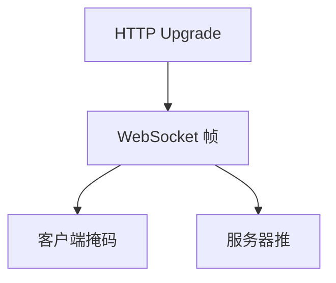

# WebSocket

HTTP 升级成一条全双工消息帧通道，不再一请求一响应；掩码与关闭握手是协议，不是套接字 API。

<footer>—— 据 RFC 6455 The WebSocket Protocol 整理</footer>

[持久连接](/cs/http11-persistent-chunked) 仍是请求–响应。[上一课](/cs/content-negotiation) 不给服务器随时推字节。缺口是 **WebSocket**：Upgrade、帧、掩码。本课不把 SSE 写完。

## 问题

聊天、协同编辑要服务器随时推。轮询浪费、长轮询半吊。WS：HTTP/1.1 `Upgrade: websocket` 握手（H2 有扩展），之后二进制帧：opcode、载荷、客户端掩码防代理缓存污染。仍跑在 TCP（或 H2 流）上，HOL 与无线掉线仍在。应用子协议在握手 Sec-WebSocket-Protocol。

不要把 WS 写成 UDP。

RFC 6455。wss 走 TLS。本课不把每 opcode 背完。

### 升级后是帧协议

全双工，客户端掩码。代理必须理解 Upgrade。连接状态要求粘滞。不是 UDP，也不是 REST。

## 方法

画：HTTP 握手 → 切换 → 双向帧。对照 QUIC DATAGRAM/WebTransport 点名。与 Cookie：握手仍带 Cookie 做会话。

方法止于选定对象与对照；机制才说它如何嵌入已有分层与主干课。

## 机制

负载均衡要粘会话，因状态在连接上——后课 L4/L7。反向代理须理解 Upgrade，否则 400。心跳：ping/pong 帧，比 TCP keepalive 更适合应用。TSO 对小消息帮助有限。

安全：跨站 WS 要 Origin 检查，不写利用。

## 边界

本课不引入 RFC 8441 的 H2 扩展细节全文。SSE 与服务器推送是下一课。后课默认：WS 是升级后的全双工帧；语义不是 REST。

防火墙只懂 GET 文件时 Upgrade 会被剥。

上一课留下的缺口在本课收口；「WebSocket」进入后课词汇表后只引用。文献用来钉对象与边界，不把本课写成该主题的独立综述。下一课[SSE 与服务器推送](/cs/sse-server-push)。

## 小结

- 握手用 HTTP 升级，之后是帧协议。
- 全双工，客户端帧掩码。
- 连接状态要求粘滞与代理支持。
- 后课只引用本课钉死的对象，不从该领域总问题重开。
- 出处：RFC 6455。
