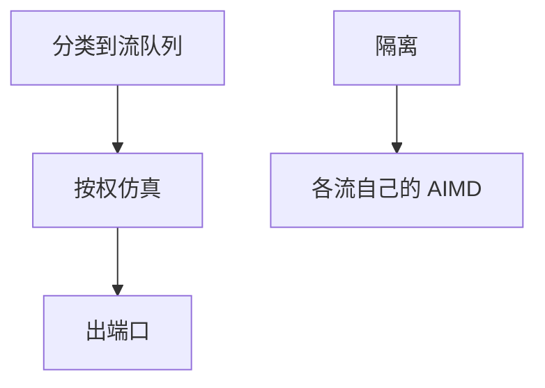
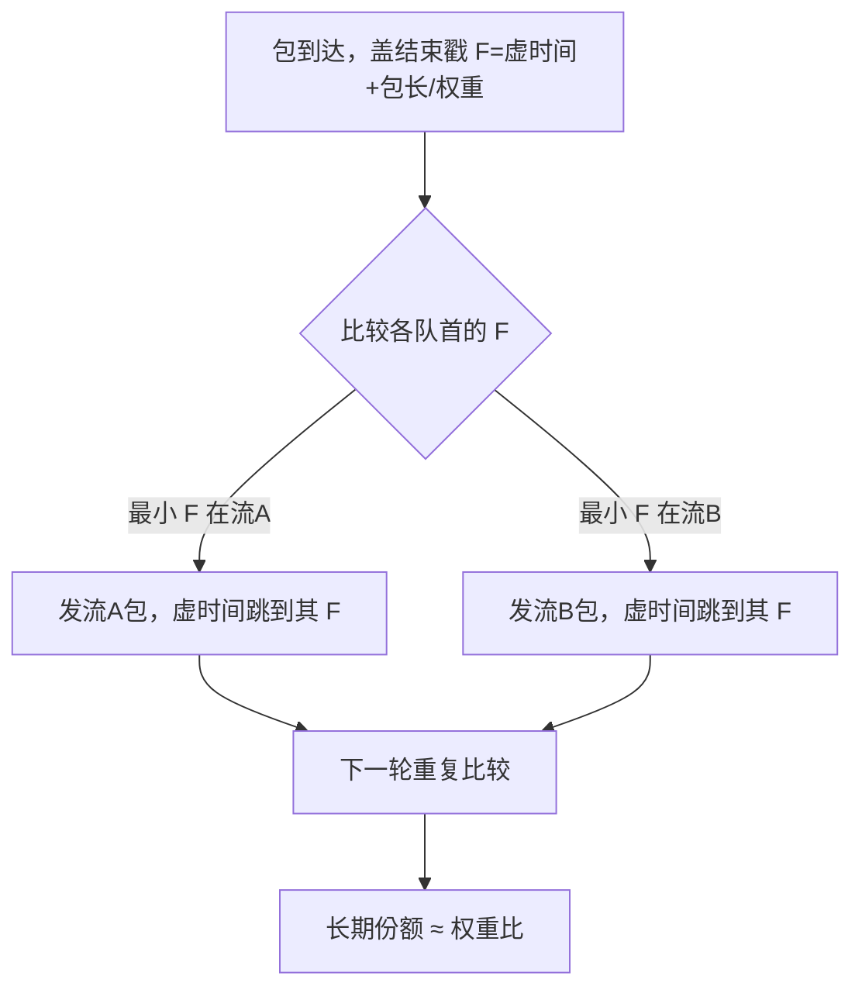

# WFQ

加权公平排队按权仿真 GPS：每流自己的队列，调度器近似按权分享 $C$，隔离大象与老鼠。

<footer>—— 据 Demers, Keshav and Shenker, SIGCOMM 1989；Parekh and Gallager, IEEE/ACM ToN 1993 GPS/WFQ 整理</footer>

[RTT 不公平](/cs/cc-fairness-rtt) 与 [缓冲膨胀](/cs/bufferbloat) 指出单队列的病。[上一课](/cs/bufferbloat) 点名 FQ-CoDel。缺口是 **WFQ/GPS 对象**：虚时间、权重、与 AIMD 的关系。本课不把令牌桶写完。

## 问题

单 FIFO 里短 RTT 大象压死一切。GPS：无穷可分流体按权分带宽。WFQ：包调度近似 GPS，复杂度高；DRR/FQ 是近似。每流隔离后，AIMD 在自己份额里收敛，RTT 偏差不再偷别人的定额。状态：流数 × 队列，ASIC 难，故数据中心少用完整 WFQ，接入网与 Linux qdisc 常见。

数字实例：链路 10 Mbps，两流权重 2:1，稳定时 A 约拿 6.7 Mbps、B 约拿 3.3 Mbps——A 的 AIMD 窗口涨到多大，也吃不掉 B 那三分之一的份额。

不要把 WFQ 写成「保证延迟上限」除非再加令牌桶准入（Parekh–Gallager）。

DKS 1989。PG 1993 给端到端延迟界条件。本课不证界。

### 隔离份额

近似 GPS，AIMD 不再互偷。完整延迟界还要整形。每流状态在核心不可扩展，用类或 FQ 近似。

## 方法

对照 FIFO / PQ / WFQ。画：分类 → 每流队列 → 按虚时间选包。与 ECMP：ECMP 选路径，WFQ 在一跳内分份额。

```mermaid
flowchart TD
  CL["分类到流队列"] --> GPS["按权仿真"]
  GPS --> OUT["出端口"]
  ISO["隔离"] --> AIMD["各流自己的 AIMD"]
```

## 机制

CoDel 可跑在每个 WFQ 队列上。DiffServ 后课用有限类而不是每流，状态少。RoCE 优先级是 PQ 不是 WFQ。5G 切片在无线侧隔离，核心仍可用类排队。

术语翻译：虚时间就是「给每个包盖一个公平戳」——包越长、所在流权重越低，戳就越靠后；调度器永远先发戳最小的那个，效果等价于让所有流按权重同时「滴流」。

```mermaid
flowchart TD
  IN["包到达，盖结束戳 F=虚时间+包长/权重"] --> Q{"比较各队首的 F"}
  Q -->|"最小 F 在流A"| SA["发流A包，虚时间跳到其 F"]
  Q -->|"最小 F 在流B"| SB["发流B包，虚时间跳到其 F"]
  SA --> NEXT["下一轮重复比较"]
  SB --> NEXT
  NEXT --> OUT["长期份额 ≈ 权重比"]
```

哈希流识别错误会把两用户捆一队列，隔离失败。

## 边界

本课不引入 WF2Q 的全部。令牌桶与整形是下一课。后课默认：每流公平排队隔离份额；完整延迟界还要整形。

常见误区：以为 WFQ 本身能保证延迟上限——只有在流量先被令牌桶整形（Parekh–Gallager 条件）时才成立；一群不受约束的突发流挤进 WFQ，只保证份额公平，不保证某条流什么时候能排出去。

核心路由器按流状态不可扩展，用类或抽样。

下一课[令牌桶与整形](/cs/token-bucket-shaping)。

## 小结

- WFQ 近似 GPS 按权分享。
- 隔离后 AIMD 不再互偷。
- 每流状态是扩展边界。
- 后课只引用本课钉死的对象，不从该领域总问题重开。
- 出处：Demers et al., 1989；Parekh–Gallager, 1993。
