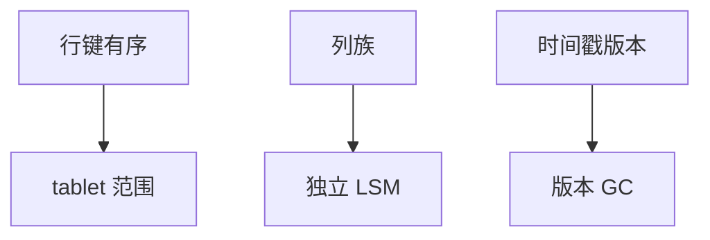

# 宽列 Bigtable

行键、列族、时间戳三维：稀疏、按行键范围切 tablet。不是 SQL 表，也不是 JSON 树；访问路径是行键设计。

<footer>—— 据 Chang et al., Bigtable, OSDI 2006；Percolator 课的底盘</footer>

[上一课](/cs/document-db)是嵌套文档。本课是稀疏宽表：Bigtable 模型。缺口是键设计决定局部性——与分片键课同构，粒度到列族。Percolator 已用此底盘做事务；本课模型本身：单行原子、跨行无（除非上层）。

## 问题

表：行键排序，列族分别存（独立 compaction），单元格可多版本时间戳。读一行一列族顺序 I/O。扫描前缀。缺口是**把查询写成行键**：倒置索引、连接预编码进键，否则全表扫。与关系 schema 相反，这里 schema 主要是族与键约定。

tablet：行键范围分片，再平衡拆范围。底层 SSTable+memtable，即 LSM。

Chang, Dean, Ghemawat et al. OSDI 2006。HBase、Cassandra 宽列变体（Cassandra 另有分区键/聚簇列）。本课 Bigtable 三维。

## 方法

设计行键避免热点（不要纯时间戳开头）。列族按访问共现分，不要一列一族。GC：按版本数或年龄，水位像 MVCC。与 SQL 层：Spanner 在类似存储上加 SQL，键仍要懂。

布隆、zone：SST 级已有。R 树不在此模型核心。

## 机制

局部性：相邻行键一起扫。连接：应用层或预连接进同一行。shuffle 发生在上层 MR/Spark。事务：行内原子；Percolator 跨行。

与文档：宽列扁平稀疏，路径用列名限定符，不是任意 JSON 深度。

## 边界

本课不讲属性图。也不把宽列当 Parquet。时序库常用宽列或倒排时间，后课专门压缩。

后课默认：宽列靠行键局部性；跨行事务要上层。图数据库：点边一等，多跳遍历是第一查询。

tablet 拆分就是范围分片，令牌环是另一放置。

## 小结

- Bigtable：有序行键、列族、版本；LSM tablet。
- 查询能力几乎等于键设计。
- 图数据库下一课。
- 出处：Chang et al., OSDI 2006；Percolator 对照。
