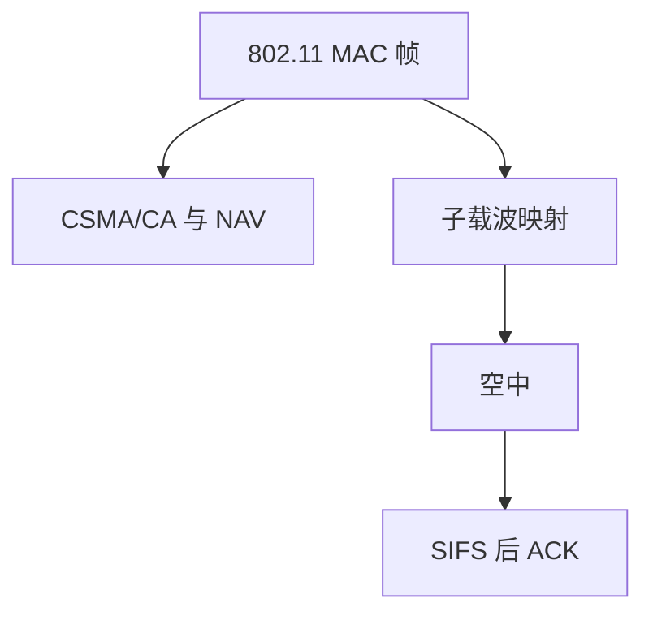

# 802.11 帧与 OFDM

无线没有可靠的载波碰撞检测，帧要带时长预约；OFDM 把宽带切成许多正交子载波，对抗频率选择性衰落。

<footer>—— 据 IEEE 802.11；Weinstein and Ebert, OFDM, IEEE Trans. Commun. 1971；Kurose and Ross 无线章整理</footer>

上一课序在[输出排队与 HOL](/cs/output-queue-hol) 收束有线交换。主干[CSMA/CA](/cs/csma-ca) 已给过退避。缺口是**帧怎么占空中、物理层怎么占频谱**：802.11 MAC 头、NAV、ACK；PHY 从 DSSS 走到 OFDM。本课不把 MIMO 矩阵写完。

## 问题

以太网全双工点到点几乎不冲突；无线是半双工共享介质，隐终端让 CD 不可靠，故 CA + RTS/CTS 预约。帧：帧控制、地址（可到四个，因为有 DS）、序号、FCS。数据帧后 SIFS 跟 ACK，失败才重传——这是链路努力，不是 TCP 的替代。OFDM：高 $R_s$ 在多径下 ISI 严重，改用慢符号率的多子载波，循环前缀吃掉时延扩展。容量仍是 $B$ 与 SNR，只是 $B$ 被切成子信道。

802.11a/g/n/ac 的 PHY 都以 OFDM 为骨干。地址字段服务基础设施 BSS：AP 与 DS。本课不把每个 subtype 背完。

### 无线 ACK 不取消 TCP

CA 补不能可靠 CD。OFDM 用多子载波抗多径。MCS 阶梯是离散工作点，瞬时 $C$ 随衰落变。AP 桥到有线，不是全国洪泛。

## 方法

画：DCF 听信道 → 发 → ACK；并行画：比特 → 编码交织 → 映到子载波 → IFFT → 加 CP。对照有线 PAM：无线必须估计每子载波信道。速率集（6–54 Mb/s 等）是调制编码方案，下一课自适应。

方法止于选定对象与对照；机制才说它如何嵌入已有分层与主干课。

## 机制

有线链路预算是电缆长度；这里是距离、遮挡、干扰。交换机学有线 MAC；无线客户端经 AP 桥到有线侧，AP 是翻译，不是 WDM 模块。巨帧在无线上更易错，重传代价高，故常保持较小 MSDU。

容量课的 $C$ 对时变信道是瞬间量，802.11 用 MCS 阶梯逼近。

## 边界

本课不引入 802.11ax 的 OFDMA 调度。MIMO 与速率自适应是下一课。后课默认：Wi‑Fi 数据面是 MAC 重传 + OFDM 比特加载。

不要把 Wi‑Fi 当蜂窝核心网：没有 RAN 切片，本课序后部才到 5G。

上一课留下的缺口在本课收口；「802.11 帧与 OFDM」进入后课词汇表后只引用。文献用来钉对象与边界，不把本课写成该主题的独立综述。下一课[MIMO 与速率自适应](/cs/mimo-rate-adaptation)。

## 小结

- CA + ACK 补上无线不能可靠 CD 的缺口。
- OFDM 用多子载波对抗多径 ISI。
- 链路 ACK 不取消 TCP。
- 后课只引用本课钉死的对象，不从该领域总问题重开。
- 出处：IEEE 802.11；Weinstein–Ebert；Kurose and Ross。
