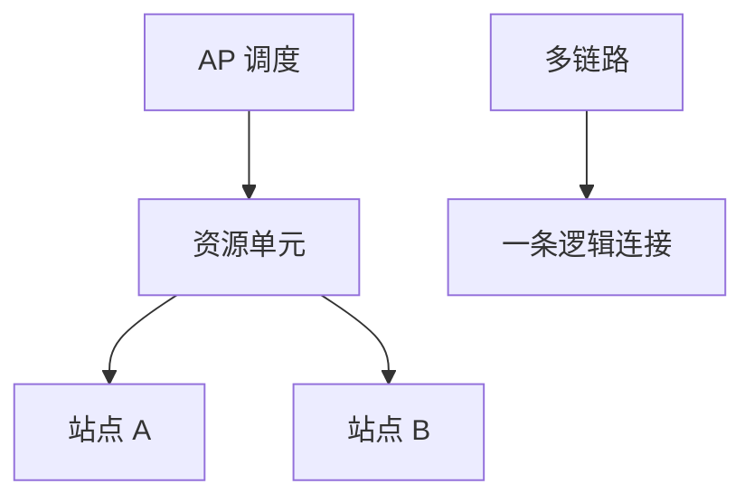

# WiFi 6 / 7 与 OFDMA

OFDMA 把一次 TXOP 切成资源单元分给多个站点，降低争用；Wi‑Fi 7 再加多链路与 4K-QAM，仍在 802.11 MAC 里。

<footer>—— 据 IEEE 802.11ax；IEEE 802.11be 草案条款整理</footer>

[上一课](/cs/mimo-rate-adaptation) 一站点占满整段 OFDM 符号。密集 BSS 里争用主导延迟。缺口是 **OFDMA**：AP 当调度器，把子载波组（RU）分给不同 STA，上/下行都可。本课不把蓝牙跳频写完。

## 问题

DCF 下站点越多碰撞越多，MCS 再高也被队列与退避吃掉。11ax：触发帧启动上行 OFDMA，站点在指定 RU 发；下行同样按 RU 复用。这是把蜂窝里的调度借到 ISM 频段，仍无牌照、仍要听信道。Wi‑Fi 7（11be）：320 MHz、MLO 多链路聚合、4096-QAM——又一次在 $C$ 下加压，对 SNR 与干扰更苛刻。

不要把 OFDMA 写成 5G 核心网：没有切片 SLA，只有 BSS 内调度。

802.11ax 引入 RU、BSS coloring。11be 的 MLO 与以太网 LACP 同类：多链路绑一条逻辑，但是空中。标准仍在演进，本课钉对象不钉某年芯片。

### AP 调度不是 5G 核心

RU 在一次 TXOP 里服务多站点，仍无牌照切片 SLA。Wi‑Fi 7 加压带宽与多链路，对 SNR 更苛刻。监管功率限制真实 $B$。

## 方法

画：AP 调度 → RU 分配 → 多 STA 同符号。对照 CSMA：调度减少随机接入，不等于消除隐藏节点。MLO：一条链路上 MCS 差可走另一条，类似自适应但跨频段。

方法止于选定对象与对照；机制才说它如何嵌入已有分层与主干课。

## 机制

有线 HOL 是结构；无线 HOL 常是整块信道被一个 STA 占满——OFDMA 对症。速率自适应仍按 RU 的 SNR 做。与 PFC 无关。主干 VLAN 可在 AP 上映射 SSID，不改 OFDMA。

BSS coloring：同频邻 BSS 可空间复用，干扰当噪声进 SNR。

## 边界

本课不引入 Wi‑Fi 与 5G 融合的全部 3GPP 附录。蓝牙与 BLE 是下一课。后课默认：11ax 起 AP 可按 RU 多用户复用。

监管功率与 DFS 雷达仍限制真实 $B$，标准表不是室内承诺。

上一课留下的缺口在本课收口；「WiFi 6 / 7 与 OFDMA」进入后课词汇表后只引用。文献用来钉对象与边界，不把本课写成该主题的独立综述。下一课[蓝牙与 BLE](/cs/bluetooth-ble)。

## 小结

- OFDMA 用 RU 在一次发送里服务多站点。
- Wi‑Fi 7 加压带宽、星座与多链路。
- 仍是 802.11 争用+调度，不是运营商核心网。
- 后课只引用本课钉死的对象，不从该领域总问题重开。
- 出处：IEEE 802.11ax；802.11be。
