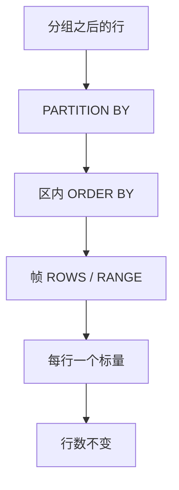

# 窗口函数

窗口在结果行上再看一组邻居：分区、排序、帧；聚合不收缩行数，排名与前后行参照同一张输出。

<footer>—— 据 SQL:2003 窗口；Ramakrishnan and Gehrke 对 OLAP 扩展；ISO SQL 对 OVER 子句的整理</footer>

[上一课](/cs/sql-aggregation)把多行收成一组一行。本课不重定义 `SUM`。缺口是：用户要「每行保留，同时看该行所在分区的合计、名次、上一行」——收缩会丢掉要展示的行。窗口函数用 `OVER` 给每一输入行指定一个窗口，计算标量后仍吐出原行（外加结果列）。

## 问题

分组把订单收成「每顾客一行」。若还要列出每张订单、并标「该顾客订单总额」「该单在顾客内的名次」，`GROUP BY` 做不到，除非自连接聚合结果。窗口把这种「按邻居算、行不删」收进声明。缺口不是新的存储引擎，而是查询语言：`PARTITION BY` 划区（像分组键但不收缩），`ORDER BY` 给区内序，帧（`ROWS`/`RANGE`）再从序上切一段。

排名（`ROW_NUMBER`/`RANK`/`DENSE_RANK`）依赖区内序，与聚合窗口不同：后者可在无序分区上对全体行求 `SUM`。`LAG`/`LEAD` 是帧上的前后参照。本课不把每一帧排除子句写完，只钉：窗口算子的输入输出基数相同（过滤仍可由外层 `WHERE` 做，但那是另一层）。

逻辑处理顺序大致是：`FROM`/`WHERE`/`GROUP BY`/`HAVING` 之后才算窗口，再 `SELECT` 与 `ORDER BY`。故窗口看不到将被 `HAVING` 丢掉的组，也不能在同一层 `WHERE` 里引用窗口结果——要包一层。

## 方法

把窗口写成 $\omega$：对当前行 $t$，窗口是同分区里按序、按帧选出的多重集 $W(t)$，再在 $W(t)$ 上求聚合或排名。物理上可排序 + 分区扫描，或把帧做成增量（滑动合计）。本课不规定算子融合；只要求指称按行定义，而不是「先 GROUP 再神秘展开」。

帧默认在有 `ORDER BY` 时常是「从分区头到当前行」（累计），无序分区上则常是整个分区。写错帧会把「累计」变成「全区重复同一合计」。这是语义，不是优化器 bug。

## 机制

窗口与分组可同句出现：先 $\gamma$ 再 $\omega$，或只 $\omega$。优化器把窗口当防火墙：不能把窗口谓词推到分区之前，除非谓词不依赖窗口结果。多个窗口可能共享同一分区排序，计划可以一次排序服务多个 `OVER`——那是实现，指称仍是分别求值。

`RANGE` 按值相等切帧，`ROWS` 按物理邻居条数切；重复排序键时两者不同。NULL 在窗口 `ORDER BY` 里的位置由 `NULLS FIRST/LAST` 约定，与 [三值](/cs/sql-null) 比较规则一致，本课不另造序。

## 边界

本课不讲流式窗口（事件时间、水位线）；那是后课分析与流。也不把窗口当成索引结构。子查询里套窗口、再与外层相关，下一课去相关要处理的是嵌套，不是本课的帧。

后课默认：需要「行上带邻居统计」时用窗口，需要「一行代表一组」时用 `GROUP BY`。两者都是声明算子，不是应用循环。

累计、排名、前后行是同一套 `OVER` 参数的不同函数，不是三种查询语言。

## 小结

- 窗口不收缩行数；分区像分组键，帧决定邻居集合。
- 逻辑上窗口在 `HAVING` 之后；引用窗口结果要再包一层。
- 去相关下一课：嵌套查询如何回到连接与窗口可执行的形状。
- 出处：SQL:2003；Ramakrishnan and Gehrke；ISO SQL。
