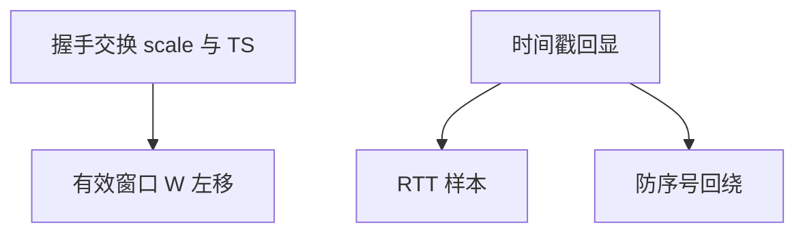

# 窗口缩放与时间戳

缩放把 16 位窗口左移，才能表示 BDP；时间戳做 PAWS 与更准的 RTT，让大窗口上的序号回绕可区分。

<footer>—— 据 RFC 7323 TCP Window Scale 与 Timestamps 整理</footer>

[上一课](/cs/bandwidth-delay-product) 算出窗口必须超过 64 KiB。主干窗口课只点名缩放。缺口是 **RFC 7323 选项**：scale 因子、TS 选项、PAWS。本课不把 MSS 钳制写完。

## 问题

窗口字段 16 位，最大 65535 字节。scale $S$ 使有效窗口 $=W\ll S$，握手时交换。中间若剥选项，一边大窗口一边小，吞吐塌——像双工错配。时间戳：每段带 TS，回 ACK 带回 echo，RTT 样本更密；PAWS 用 TS 丢旧包，防 1 Gb/s 上 32 位序号回绕。卫星与 10G 都需要。

不要把时间戳当成 NTP 同步：它是连接内单调时钟，不必与世界时对齐。

RFC 7323 取代 1323。中间盒对选项不友好是运营现实。本课不把 TSopt 格式逐比特背。

### 选项在握手钉死

缩放才能表示 BDP。时间戳服务 RTT 与 PAWS，不是 NTP。中间剥选项造成假流控。

## 方法

画三次握手带上 scale 与 TS。对照：无缩放的长肥管道永远 AIMD 不满。安全：时间戳可作隐蔽信道或指纹，政策可关，代价是 PAWS 与 RTT。

方法止于选定对象与对照；机制才说它如何嵌入已有分层与主干课。

## 机制

快恢复的 FlightSize 用缩放后窗口。SYN cookies 后课可能丢掉某些选项，大窗口失败。QUIC 后课自带 32 位以上流控，不借 TCP 选项。ECN 与 TS 正交。

测量：抓包看 wscale 因子；iperf 差常是这边没协商上。

## 边界

本课不引入 TCP AO 认证选项全文。MSS 与钳制是下一课。后课默认：长肥管道必须缩放；TS 服务 RTT 与 PAWS。

盲目关选项「为了安全」会把卫星用户窗死。

上一课留下的缺口在本课收口；「窗口缩放与时间戳」进入后课词汇表后只引用。文献用来钉对象与边界，不把本课写成该主题的独立综述。下一课[MSS 与钳制](/cs/mss-clamping)。

## 小结

- 窗口缩放表达 BDP；双方握手同意。
- 时间戳用于 RTT 与 PAWS。
- 中间剥选项造成假流控。
- 后课只引用本课钉死的对象，不从该领域总问题重开。
- 出处：RFC 7323。
