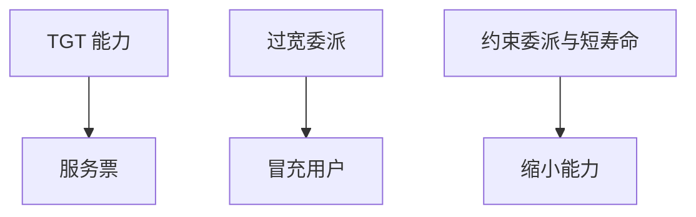

# Windows Kerberos 攻击

Kerberos 把票据当能力。票据太强、哈希可离线、委派过宽时，域内横向变成协议合同问题。防御是限制委派、保护 KRBTGT、短寿命，而不是默记攻击商品名。

<footer>—— 据 RFC 4120；Bellovin and Merritt 对 Kerberos 的早期讨论；Microsoft 对委派与 PAC 的文档；对照主干[Kerberos](/cs/kerberos)</footer>

## 定位

上一课[Linux 提权](/cs/linux-privesc)是主机。缺口是**域身份**：主干 Kerberos 直觉已有 TGT。本课收 Windows 域常见合同失败（黄金票据一类只作机制点名），不给复制步骤。

后课默认已经读完本课钉下的合同，只补差，不从该领域第一性原理重开。

## 问题

TGT 与服务票若被盗，离线与重放窗口打开。无约束委派让服务拿用户票再冒充。缺口是：保护域控、限制委派、监控异常 TGT。

### 哈希不等于口令

长期密钥材料泄漏可造票。口令策略挡不住已盗的密钥。

RFC 4120。课程禁止 Kerberos 攻击操作指导。只讲：票据是能力，能力过宽则横向。

## 方法

对照 Linux sudo：域里是委派与 PAC。硬化：约束委派、受保护用户组、KRBTGT 轮换流程。下一课 TEE。

图中节点是本课的机制骨架；课程不把图展开成可运行的攻击步骤。

## 机制

身份在票据里。HSM/TEE 下一课把密钥再往硬件里塞。

前提写进合同之后，游戏外的误用只当失败模式点名，不在本课写成操作程序。

## 边界

不写造票步骤。TEE：SGX/TrustZone 下一课。

## 小结

- 主机提权之外，域票据是横向能力。
- 委派与 KRBTGT 是合同核心。
- 点名失败模式，不给操作链。
- 下一课 TEE。
- 出处：RFC 4120；Bellovin and Merritt；Microsoft 委派文档；[kerberos](/cs/kerberos)。
