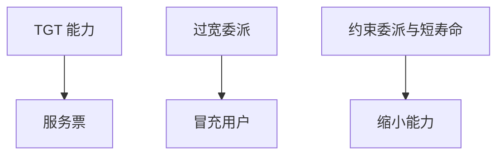
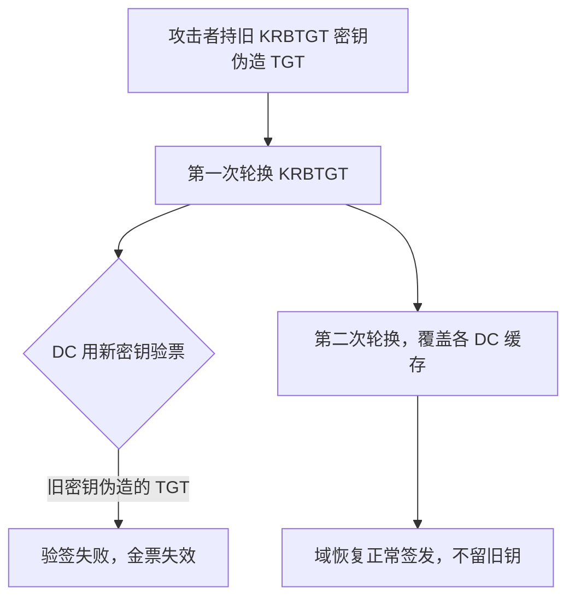

# Windows Kerberos 攻击

Kerberos 把票据当能力。票据太强、哈希可离线、委派过宽时，域内横向变成协议合同问题。防御是限制委派、保护 KRBTGT、短寿命，而不是默记攻击商品名。

<footer>—— 据 RFC 4120；Bellovin and Merritt 对 Kerberos 的早期讨论；Microsoft 对委派与 PAC 的文档；对照主干[Kerberos](/cs/kerberos)</footer>

上一课[Linux 提权](/cs/linux-privesc)停在单机。本课补**域身份**这一缺口：主干 [Kerberos](/cs/kerberos) 已给过 TGT 直觉，这里收 Windows 域里常见的合同失败——票据太强、哈希可离线、委派过宽（黄金票据一类只作机制点名），不给可复制的步骤。

后课默认已经读完本课钉下的合同，只补差，不从该领域第一性原理重开。

## 问题

TGT 与服务票一旦被盗，两扇窗同时打开：服务票的加密块可被离线爆破，服务账户口令弱时数小时内即得密钥；票据寿命之内可以重放。无约束委派更糟——被委派的服务能拿到用户的可转发票据，转身冒充该用户访问任意后端。缺口因此是三件事：保护域控、限制委派、监控异常 TGT（寿命、请求模式、加密类型）。

### 哈希不等于口令

Kerberos 的长期凭据是密钥材料而非口令本身：NT 哈希与口令等价。长期密钥材料一旦泄漏即可离线自签票据，口令策略再严也拦不住已拿走密钥的人——能拦的是轮换与短寿命。

直觉类比：NT 哈希像你家门锁的钥匙坯——服务器不记「你设了什么口令」，只存钥匙本身的形状；谁复制了钥匙坯，改口令策略都没用，唯一的解是换锁（轮换密钥）。

RFC 4120。课程禁止 Kerberos 攻击操作指导。只讲：票据是能力，能力过宽则横向。

## 方法

对照 Linux 的 sudo：单机把能力收敛在 sudoers 规则里，域里则收敛在委派配置与 PAC 上。硬化对应缺口三件套：委派改约束式，限定目标服务与协议；敏感账户进受保护用户组，拒绝降级加密；KRBTGT 建立两轮轮换流程，使旧票全部失效要覆盖一个最大票据寿命。下一课 TEE。

```mermaid
flowchart TD
  TGT["TGT 能力"] --> SVC["服务票"]
  DEL["过宽委派"] --> IMP["冒充用户"]
  HARD["约束委派与短寿命"] --> LIM["缩小能力"]
```

## 机制

机制上的根源是「身份完全在票据里」：验证方只认票不认人，票即能力，谁持有谁就是那个身份。合同的关键参数因此是寿命与范围——短寿命压缩重放窗口，约束委派划定能力边界；二者任一失守，横向只剩检测可用。HSM/TEE 下一课把密钥再往硬件里塞。

术语翻译：无约束委派就是「把整张通行证借给前台代办」——前台能拿它去任何后端；约束委派换成「只准代办指定一间房、办指定一件事」的限用单据，能力边界被写死。

```mermaid
flowchart TD
  K1["攻击者持旧 KRBTGT 密钥伪造 TGT"] --> R1["第一次轮换 KRBTGT"]
  R1 --> V{"DC 用新密钥验票"}
  V -->|"旧密钥伪造的 TGT"| FAIL["验签失败，金票失效"]
  R1 --> R2["第二次轮换，覆盖各 DC 缓存"]
  R2 --> OK["域恢复正常签发，不留旧钥"]
```

## 边界

不写任何造票与导出步骤；黄金票据只作为「KRBTGT 长期不轮换」的失败模式被点名。TEE（SGX/TrustZone）下一课。

为什么重要：KRBTGT 是域内所有 TGT 的签发密钥，泄漏等于身份证打印机被偷；只轮换一次不够——旧密钥可能还留在备份 DC 缓存里，标准做法是两轮轮换并覆盖一个最大票据寿命，才能确认伪造票全部过期。

## 小结

- 单机提权之外，域票据本身就是横向能力。
- 委派宽度与 KRBTGT 轮换是合同的核心参数。
- 只点名失败模式，不给操作链。
- 下一课 TEE。
- 出处：RFC 4120；Bellovin and Merritt；Microsoft 委派文档；[kerberos](/cs/kerberos)。
