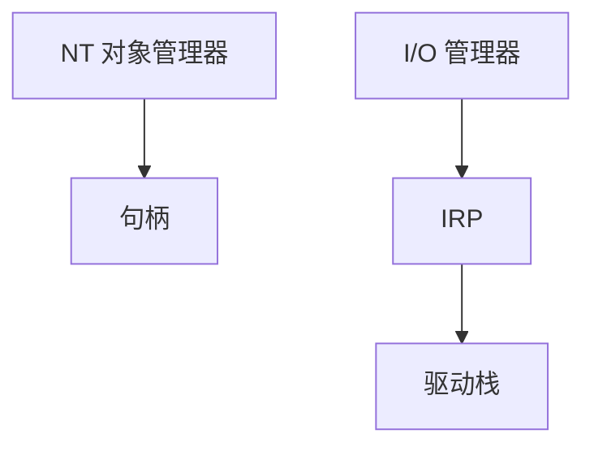

# Windows NT 对照

NT 用对象管理器统一进程、文件、设备：句柄表、I/O 请求包 IRP、注册表，而不是「一切皆 Unix 文件描述符」的同一套。

<footer>—— 据 Russinovich, Solomon, Ionescu, <em>Windows Internals</em>；[VFS](/cs/vfs) 与 [设备模型](/cs/device-model-binding) 为 Linux 侧先修</footer>

[Rust in kernel](/cs/rust-in-kernel) 仍在 Linux。课程序列需要 **对照**：同一问题 NT 如何切对象。不是教你写 NT 驱动教程。

## 问题

句柄：带访问权的对象指针。IRP：异步 I/O 的统一包，类似 bio+skb 的职务在 I/O 管理器。缺口：NT 命名空间 `\Device\...` vs Unix `/dev`；作业对象约等于 job≈cgroup 亲戚。本课不把 Win32 与 NT 原生 API 的每一层写完。

Hyper-V 类型 1 与 NT 的关系：NT 可当根分区。对象是内核架构对照。

## 方法

对照表只点：调度（优先级+量子 vs CFS/EEVDF）、内存（工作集 vs RSS/memcg）、文件（NTFS vs ext4 已在 FS 课）、网络（NDIS vs sk_buff）。对照 [capabilities](/cs/linux-capabilities)：NT 是 ACL+特权。对照 [ioctl](/cs/chardev-ioctl)：DeviceIoControl/IRP_MJ_DEVICE_CONTROL。

## 机制

NT 证明宏内核不必 Unix 形状：对象+IRP 同样能覆盖进程与设备。可移植课序要求会翻译，而不是背命令。不要写成哪边更好。与 [SELinux](/cs/lsm-selinux)：MIC/完整性级别是另一套 MAC。

用户态子系统（Win32、WSL）说明 ABI 可叠在 NT 上——WSL2 实际是轻量 VM，接回 [Hypervisor](/cs/hypervisor-types) 课。

实现上：IRP 可在驱动栈里同步或异步完成，取消路径复杂。作业对象限 CPU/内存，像 cgroup 的远亲。WSL2 用轻量 VM，对照的是 Hyper-V，不是 NT 原生 Unix。 读法上只引用[上一课](/cs/rust-in-kernel)的结论，不把对象换成训练推理或限价簿。

本课在操作系统进阶的「虚拟化与隔离进阶 / 容器与内核形态」课序里，对象是 **Windows NT 对照**。

- 先修只引用，不重导：上一课的结论当公理，本课只补差。
- 五栏不吞并：不把本课写成大模型训练/推理，也不写成限价簿或权重量化。
- 文献用 OSTEP、McKusick、内核文档与具名会议论文；不发明 arXiv 编号。

## 边界

本课不引入所有执行体组件。不保证 ReactOS。下一课课序封口：分布式 OS 直觉。

版本字段会变，课序钉的是机制对象「Windows NT 对照」，不是某一主线内核的结构体名。
后课默认：宏内核可以是 NT 对象模型。多机看起来像一台 OS 的限度，下一课。

## 小结

- NT：对象管理器、句柄、IRP。
- 与 Linux 的 VFS/cgroup/skb 是同问题不同切法。
- 分布式 OS 直觉是下一课。
- 出处：*Windows Internals*；Tanenbaum 对照。
