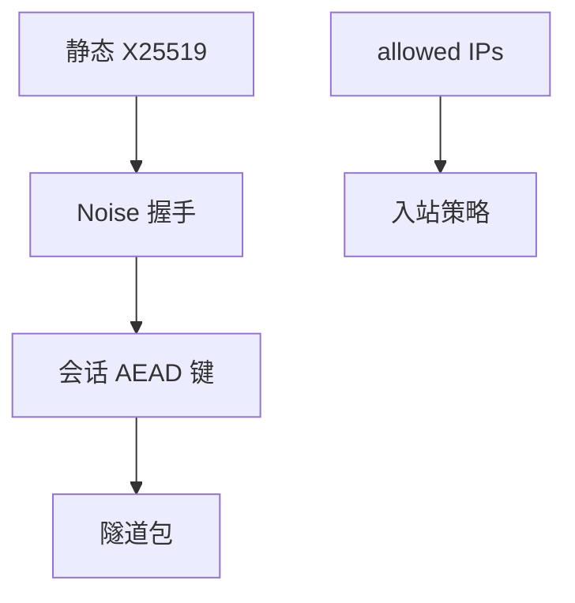

# WireGuard

WireGuard 把隧道收成：Curve25519 静态钥、Noise 握手、ChaCha20-Poly1305、每接口一张密码表。代码面小，是为了让「验过」成为可能，不是为了再发明一种 AES。

<footer>—— Donenfeld, WireGuard: Next Generation Kernel Network Tunnel；Noise Protocol Framework</footer>

## 定位

上一课[IPsec](/cs/ipsec-ike)功能全、配置面大。缺口是**故意缩小的 VPN 合同**：固定套件、静态公钥当身份、内核里短路径。不重写 X25519。

后课默认已经读完本课钉下的合同，只补差，不从该领域第一性原理重开。

## 问题

IKE 的算法协商与策略语言易配错。WireGuard：身份=公钥，允许列表=谁能进接口，握手用 Noise（含可选预共享）。缺口是端点 IP 漫游与密钥轮换的简单模型，以及「静态钥长期化」对前向保密的影响（握手仍有临时 DH）。

### 不是隐匿工具

默认不是反审查。握手包可被识别。Tor 更后。

Donenfeld 白皮书。Linux 主线 wg。本课不写指纹识别隧道的测量步骤。

## 方法

对照 IPsec：无版本降级、无用户空间百万行。指出需要用户空间做分配与编排（wg-quick、控制面）。身份仍要带外分发公钥，TOFU 问题换了层。

图中节点是本课的机制骨架；课程不把图展开成可运行的攻击步骤。

## 机制

小 TCB 降低实现漏洞密度，不降低密钥分发与端点信任问题。下一课把 VPN 对照零信任：隧道把人放进网，不等于应用该信这个人的每一次请求。

前提写进合同之后，游戏外的误用只当失败模式点名，不在本课写成操作程序。

## 边界

本课不把 Noise 图案全表抄写。VPN 对零信任下一课改假设：网络位置 ≠ 授权。

## 小结

- IPsec 全功能；WireGuard 固定套件与小实现。
- 静态公钥身份 + 临时握手键。
- 允许列表是策略，不是密码分析。
- 下一课：VPN 对零信任。
- 出处：Donenfeld, WireGuard；Noise Protocol Framework；RFC 7748。
