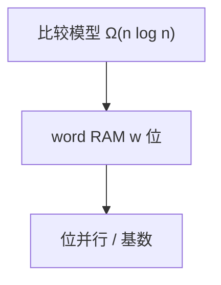

# word RAM 与位并行

字长 $w=\Theta(\log n)$ 时，一次字运算处理 $w$ 比特；排序、选择、编辑距离都能比比较模型更快。

<footer>—— 据 Fredman and Willard；Hagerup 字模型综述；Myers 位并行；[序列比对](/cs/sequence-alignment) 整理</footer>

上一课[对手论证](/cs/adversary-argument)钉死比较模型下界。word RAM：内存字 $w$ 位，加减与位运算 $O(1)$。缺口是这个模型如何**绕开** $\Omega(n\log n)$：基数排序、融合树、位集。算法进阶课程在此收束。不重写 Myers 细节。不写 Transformer、不进限价簿。

## 问题

比较模型每问 1 比特。word RAM 一次可读 $w$ 个键的高位或做掩码。整数排序：$O(n\log\log n)$ 等（Thorup 等，点名）。位图集合运算 $O(n/w)$。Myers 编辑距离 $O(nm/w)$ 已见。popcount、前导零是硬件原语。

缺口是模型，不是再证比较下界无效——下界换模型即失效。

### $w$ 太小或太大都不自然

$w=\Theta(\log n)$ 可当地址。$w=n$ 则一次运算过大，模型作弊。转位表、四俄国人法是 $w$ 与块的折中。

Fredman–Willard 融合树。Hagerup 综述。本课程从 SCC 到 word RAM：图、代数、DP、串、几何、随机近似、最后模型。后课若有附录不插入主干。

## 方法

把状态打进字：状压 DP 的一行、NFA 位集、网格位图。注意移位方向与字边界。复杂度写 $O(n/w)$ 时声明 $w$。

转回比较模型须显式模拟代价。

## 机制

信息论下界按比特，字运算一次买 $w$ 比特。与 NTT：字里的模乘仍是一次。与 PRAM：并行是多核；位并行是核内 SIMD/字。与几何谓词：字 RAM 不自动给精确实数。

## 边界

本课不写融合树全证明。不写电路深度。算法进阶封口：后课默认会选模型——比较、RAM、word RAM、I/O、PRAM、流、在线。下一课程从 [lex / flex](/cs/lex-flex) 起编译器生成器。

## 小结

- word RAM 一次 $w$ 比特，可破比较下界。
- 位并行、基数、融合树是实例。
- $w=\Theta(\log n)$ 才诚实。
- 出处：Fredman and Willard；Myers, 1999；Knuth 位技巧。
