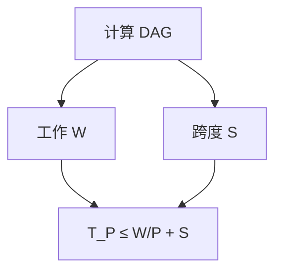

# Work-span 与 fork-join

工作 $W$ 是总运算，跨度 $S$ 是依赖最长链；贪心调度 $P$ 核上时间 $\le W/P+S$。

<footer>—— 据 Brent, The Parallel Evaluation of General Arithmetic Expressions, 1974；Cilk / Blumofe–Leiserson 工作窃取整理</footer>

上一课[PRAM 前缀和](/cs/pram-prefix-sum)给了 $W=O(n)$、$S=O(\log n)$。缺口是 work-span 模型：不必假设 $n$ 台处理器。fork-join：`spawn` 子任务，`sync` 等待。不重写前缀树。后课排序网络是比较器电路。Cilk 工作窃取期望。

## 问题

DAG：结点运算，边依赖。$W=$ 结点数，$S=$ 最长路。Brent：$T_P\le W/P+S$（忽略调度开销）。工作窃取：闲核偷他人双端子任务，空间与时间高概率近最优。

缺口是调度定律，不是再写前缀代码。

### 不是 $P$ 倍加速永远成立

$S$ 限制：$T_P\ge S$。Amdahl 串行段。$W/P$ 是另一下界。不要只报「并行了」。

Brent 1974。Blumofe–Leiserson Cilk。后课排序网络跨度是比较器层数。

## 方法

写分治：`fork` 两半，`join`，线性工作。分析 $W(n)=2W(n/2)+O(n)$，$S(n)=S(n/2)+O(1)$。加速比 $T_1/T_P$。

递归生成的任务树要足够粗，避免开销。

## 机制

任意时刻就绪任务 $\ge$ 可并行度。贪心总能让 $P$ 核不闲除非不够任务。工作窃取把双端队列当任务池。与 PRAM：PRAM 假定同步与冲突规则；work-span 更接近语言。

## 边界

本课不写 GPU occupancy。不写锁。后课默认：并行算法报 $W$ 与 $S$。下一课排序网络。

## 小结

- $T_P\le W/P+S$；$T_P\ge\max(W/P,S)$。
- fork-join 表达分治 DAG。
- 工作窃取近最优调度。
- 出处：Brent, 1974；Cilk 工作窃取。
