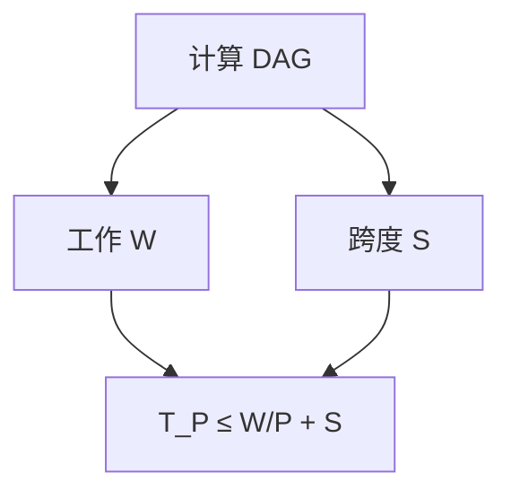
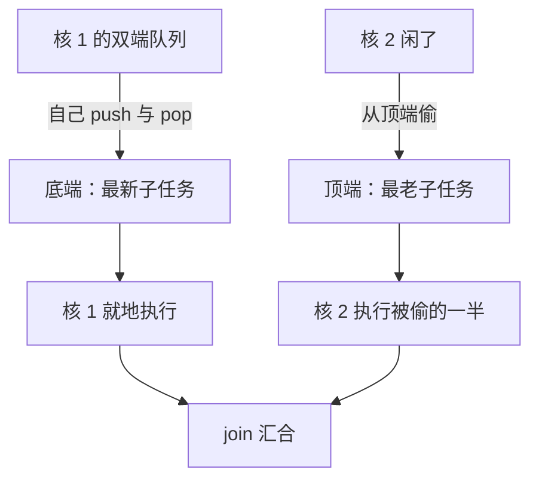

# Work-span 与 fork-join

工作 $W$ 是总运算，跨度 $S$ 是依赖最长链；贪心调度 $P$ 核上时间 $\le W/P+S$。

<footer>—— 据 Brent, The Parallel Evaluation of General Arithmetic Expressions, 1974；Cilk / Blumofe–Leiserson 工作窃取整理</footer>

上一课[PRAM 前缀和](/cs/pram-prefix-sum)已给出 $W=O(n)$、$S=O(\log n)$；缺口是把这两个量变成真正的成本模型——不再假设 $n$ 台处理器齐步走。fork-join 给出表达：`spawn` 子任务、`sync` 等待。本课不重写前缀树；后课排序网络是比较器电路，Cilk 工作窃取的期望界在本课收拢。

## 问题

把计算看成 DAG：结点是运算，边是依赖；$W$ 是结点数，$S$ 是最长路。Brent 调度定律给出上界 $T_P\le W/P+S$：$P$ 个核要么在干活（贡献 $W/P$），要么在等关键链走完（贡献 $S$）。工作窃取调度把这个界变成可实现的：闲核从别的核双端队列另一端偷子任务，空间与时间都高概率近最优。

缺口是调度定律，不是再写前缀代码。

### 不是 $P$ 倍加速永远成立

加速比有硬顶：$T_P\ge S$ 是关键链决定的下界，$T_P\ge W/P$ 是工作量决定的下界，Amdahl 的串行段只是 $S$ 的直观说法。报告并行结果要同时给 $W$、$S$ 与实测数据，不要只报「并行了」。

直觉类比：跨度就是「流水线上最慢的那条链」——雇一万个人也快不过炖汤的那口锅。$T_P\ge S$ 说的正是：任何调度都短不过最长依赖链，加处理器买不来这段等待。

Brent 1974。Blumofe–Leiserson Cilk。后课排序网络跨度是比较器层数。

## 方法

方法是把分治写成 fork-join：`fork` 两半、`join` 合并、合并做线性工作；随即读出 $W(n)=2W(n/2)+O(n)$ 与 $S(n)=S(n/2)+O(1)$——归并排序在这个模型里天然并行，加速比 $T_1/T_P$ 的上界是 $\min(P,\,W/S)$。

```mermaid
flowchart TD
  DAG["计算 DAG"] --> W["工作 W"]
  DAG --> S["跨度 S"]
  W --> TP["T_P ≤ W/P + S"]
  S --> TP
```

任务粒度要足够粗：递归切到单叶任务只剩几十条指令时，调度开销反过来吃掉并行收益。

数字实例：$W=10^8$ 条指令、$S=10^4$ 层、$P=100$ 核时，$T_P$ 的上界是 $10^8/100+10^4=1.001\times 10^6$——先按工作量均摊，再加关键链，两项相加就是界的形状。两项差一个数量级时，谁大谁就是瓶颈。

## 机制

机制在调度器一侧：任意时刻的就绪任务数给出当前可并行度，贪心调度总能让 $P$ 个核不闲，除非就绪任务不够——这正是 $W/P+S$ 两项的来源。工作窃取把双端队列当任务池：本核从底端压弹自己的任务，偷取从顶端拿，两端无锁竞争，局部性也保住了。与 PRAM 对照：PRAM 假定全局同步与访存冲突规则，work-span 直接挂在语言运行时上，更接近真实机器。

窃取在队列两端如何分工：

```mermaid
flowchart TD
  DQ["核 1 的双端队列"] -->|"自己 push 与 pop"| BOT["底端：最新子任务"]
  BOT --> RUN1["核 1 就地执行"]
  IDLE["核 2 闲了"] -->|"从顶端偷"| TOP["顶端：最老子任务"]
  TOP --> RUN2["核 2 执行被偷的一半"]
  RUN1 --> JOIN["join 汇合"]
  RUN2 --> JOIN
```

为什么重要：从顶端偷、从底端拿，让最热的最新任务留在本核，被偷走的总是最冷最老的整棵子树——一次偷取搬一大块，摊薄了窃取的同步开销，还顺手保住了缓存局部性。

## 边界

本课不写 GPU 的 occupancy 账，不写共享内存锁——fork-join 假设任务间无数据竞争。后课默认：并行算法报 $W$ 与 $S$。下一课排序网络。

## 小结

- $T_P\le W/P+S$；$T_P\ge\max(W/P,S)$。
- fork-join 表达分治 DAG。
- 工作窃取近最优调度。
- 出处：Brent, 1974；Cilk 工作窃取。
