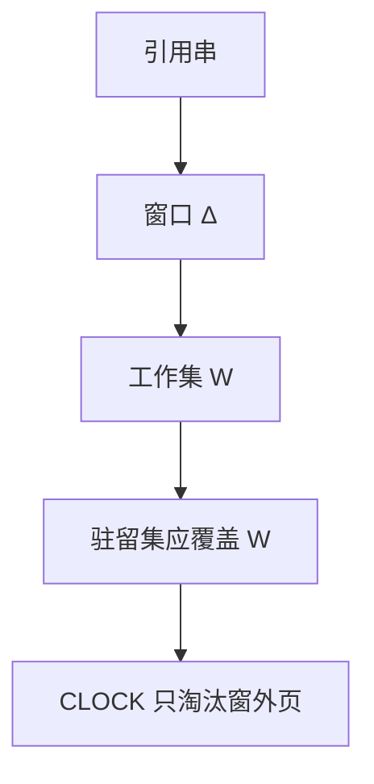

# 工作集

程序在时刻 t 的工作集，是过去 Δ 个引用里触及的页集合；驻留集应盖住它，而不是盖住整个虚空间。

<footer>—— 据 Denning, The Working Set Model for Program Behavior, CACM 1968 整理</footer>

[上一课](/cs/clock-replace)能在帧之间转圈，却没有说**该给这个进程多少帧**。[按需调页](/cs/demand-paging)已用工作集解释「虚大于物仍可跑」，当时是口号。缺口是把 Δ 窗口收成置换与多道的输入：工作集大小 W(t, Δ) 随相位变；时钟指针应优先留下窗口内的页。

## 问题

全局 CLOCK 可能把刚要跑的进程页全部抢走，下一次调度立刻 major 缺页。局部配额若是固定帧数，相位一变就浪费或不足。Denning 的缺口：用近期引用集当「现在必须在内存里的页」。Δ 太大则工作集接近全部虚页；太小则抖动。本课不把 Δ 的最优估计写成一条公式交差。

本课不引入工作集采样的全部内核计数器。

WSClock：时钟扫描时看「上次使用是否落在 Δ 内」，把 CLOCK 与工作集合并。PFF（缺页频率）用缺页率涨落加减帧，是另一条控制回路。

## 方法

为进程维护近期页集合（硬件访问位 + 周期性采样，或引用串的软件窗口）。置换时：窗口内的页不当牺牲；窗口外的可以给 CLOCK 扔掉。分配帧时：试图让驻留集 ≥ W(t, Δ)。做不到就不要再提高多道——下一课抖动。预调可以一次装入工作集的邻页，仍属按需的加速，不是改变窗口定义。

## 机制

工作集把局部性从 Cache 课接到多道：CPU 调度看到的「可运行」，隐含「其工作集已在内存」。否则调度只是把缺页从一个进程转到另一个。它不改 [分页](/cs/paging-vm) 的翻译，只改帧的归属策略。与公平调度对照：CFS 分的是 CPU 时间；工作集分的是帧。两者同时紧张时，先减多道比先减时间片更对——理由下一课展开。

## 边界

本课不保证能精确测量 W：采样有滞后，多线程共享地址空间时窗口是进程级还是线程级，实现各异。也不把工作集当成数据库缓冲池的同义词；那是文件页 Cache 的后课。Δ 与时钟中断频率有关，但不是 jiffies 课。

后课默认：驻留集应对准工作集。当所有进程的 W 之和超过物理内存，任何置换都会失败，下一课叫抖动。

## 小结

- 工作集是窗口 Δ 内的页集；驻留应覆盖它。
- WSClock / PFF 是把窗口接到 CLOCK 的控制。
- 覆盖失败时的系统行为是抖动课的缺口。
- 出处：Denning, *CACM* 1968；Silberschatz et al., *OSC*；Tanenbaum *MOS*。
