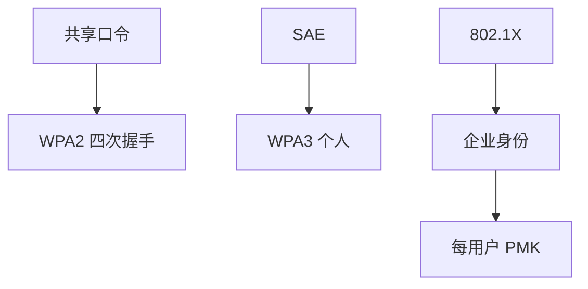

# WPA2 / WPA3

无线是广播介质：加密与认证必须当所有邻居都在听。WPA2-PSK 把口令变成全网共享秘密；WPA3-SAE 改善握手，口令仍不是企业身份。

<footer>—— IEEE 802.11i；WPA3 规范；对照 Fluhrer 对 WEP 的历史教训</footer>

## 定位

上一课[VPN 与零信任](/cs/vpn-zero-trust)警告位置不等于身份。缺口是**最后一跳**：802.11。WEP 已死；本课对照 WPA2 与 WPA3，不把射频当光刻课。

后课默认已经读完本课钉下的合同，只补差，不从该领域第一性原理重开。

## 问题

开放网络无保密。WPA2-PSK：同一口令派生 PTK，握手可被离线猜口令——只陈述性质。企业 802.1X 把身份交给 RADIUS。WPA3-SAE 抗离线猜（在合同内）。缺口是链路层合同，不是应用 SSO。

### 访客与分割

同一 SSID 上的客户隔离是策略。PSK 网里邻居曾能彼此解密广播的历史问题，要用隔离与企业认证。

802.11i。KRACK 作为重装密钥的失败模式点名，不给步骤。Dragonfly/SAE 是 WPA3 个人模式。

## 方法

分个人 PSK 与企业 EAP。指出管理帧保护、前向保密在 WPA3 的改进。对照：上了 WPA3 仍要 vis-à-vis 应用 TLS——链路密钥不管 HTTPS 以外的威胁全覆盖。

图中节点是本课的机制骨架；课程不把图展开成可运行的攻击步骤。

## 机制

广播介质迫使 AEAD 与认证在链路上出现。PSK 把口令熵当成全网密钥材料。下一课离开链路，看名称系统：DNS 缓存如何把人带到错误的 TLS 名前。

前提写进合同之后，游戏外的误用只当失败模式点名，不在本课写成操作程序。

## 边界

本课不写抓握手的操作。DNS 缓存投毒下一课：解析路径上的欺骗。

## 小结

- 隧道之上，无线仍是广播。
- WPA2-PSK 共享秘密；WPA3-SAE 改握手；企业用 802.1X。
- 链路保密不替代应用 TLS 与身份。
- 下一课 DNS 缓存投毒。
- 出处：IEEE 802.11i；WPA3；Fluhrer, Mantin and Shamir 对 WEP（历史）。
