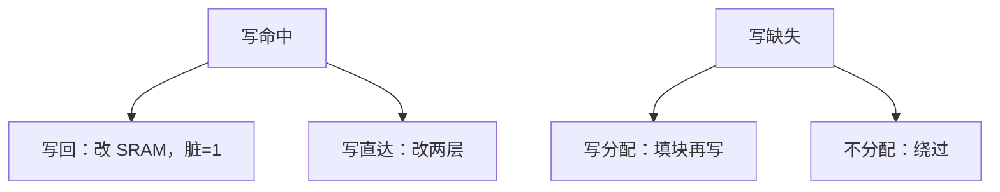

# 写回与写分配

写命中可以只改 SRAM 并打脏位，也可以同时改下一层；缺失时可以先把块取来再写，也可以绕过 cache。

<footer>—— 据 Patterson and Hennessy, Computer Organization and Design (RISC-V)；Hennessy and Patterson, CA:AQA 整理</footer>

[上一课](/cs/fully-associative)让一块在组内有多路可放，满了用 LRU 踢。[局部性原理](/cs/locality-principle)对写同样成立：刚写过的字往往还要写。本课不重讲相联度。缺口是：前面几课几乎只谈读命中。写一旦发生，SRAM 与 DRAM 可能不一致，踢块时必须知道要不要把数据送回。[SRAM 与 DRAM 阵列](/cs/memory-array-sram-dram)不能默认两边永远相等。本课只钉写直达/写回，以及写分配/不分配。

## 问题

读缺失的语义清楚：把块取进 cache 再读。写命中有两条路：写直达（SRAM 与下一层一起改）或写回（只改 SRAM，置脏位）。写缺失也有两条：写分配（先把块取来再当写命中）或不分配（写绕过 cache 直接去下一层）。缺口不是新的标签格式，而是**这四条组合里哪两条配在一起，以及替换时脏块必须写回**。

没有脏位，写回无法知道踢谁时要不要访 DRAM。没有写缓冲，写直达会把流水线钉在每条 store 的 DRAM 延迟上。

教学默认「写回 + 写分配」与「写直达 + 不分配」常成对出现。不是物理定律，是常见搭配。

## 方法

写回：命中只写 SRAM，脏位置 1。替换若选中脏路，先把该块写到下一层，再填入新块。写直达：命中同时写下一层，脏位可省；常用写缓冲把 CPU 与 DRAM 解耦。

写分配配合写回：缺失时取块，再在 cache 里完成写，后续写命中。不分配配合写直达：一次性写不污染 cache。本课取写回加写分配为后课默认。

## 机制

写回减少对 DRAM 的写流量：一块上的多次写合并成一次替换时的写回。代价是层次之间暂时不一致。单核、无 DMA 时，CPU 总从 cache 读，看不见这个问题；[一致性问题引入](/cs/coherence-intro)会把它重新打开。

写缓冲让写直达的 store 不必等 DRAM 完成即可提交，但缓冲与后续 load 之间要做转发或探测，否则读到旧 DRAM。本课只承认缓冲存在，不把实现写完。

## 边界

本课不引入 MESI，不处理多核。也不把脏位与操作系统的脏页混名：页的脏是虚拟内存课的对象，粒度是页不是 cache 行。I/O DMA 绕过 cache 时，写回的不一致会变成正确性问题，那是一致性课的缺口。

后课默认：数据 cache 写回且写分配；替换脏块先写下一层。缺失分类仍可以把写缺失算进去。

## 小结

- 写回改 SRAM 打脏位，替换时才写下一层；写直达两边一起改。
- 写分配在缺失时填块；不分配绕过。
- 多副本如何达成一致是后课的缺口。
- 出处：Patterson and Hennessy, *COD* RISC-V；Hennessy and Patterson, *CA:AQA*。
