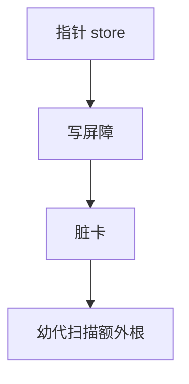

# 写屏障与卡表

分代或增量 GC 不能每次扫描全堆。写屏障在指针写入时记录「脏」：老→幼的引用进记忆集，卡表用一字节标记一页有写。

<footer>—— 据 Ungar, Generation Scavenging；Wilson and Moher；Jones 手册；HotSpot 卡表实践整理</footer>

上一课[引用计数](/cs/refcounting-gc) 在赋值处做事。追踪式分代也在赋值处做事，但目的不同：**记住跨代指针**。缺口是写屏障与卡表。并发 GC 下一课还要用屏障维持三色。主干分代课已给「幼代多死」。

## 问题

只扫幼代：必须知道老年代谁指向幼代，否则漏标。记忆集：精确到对象或到卡（512B）。写屏障：`*p=q` 时若 p 老 q 幼则标脏。缺口是**这笔商店税**，不是 RC 循环。

JIT 必须在每条指针 store 插屏障（可优化消除显然的同代）。

### 卡表不是 CPU cache

card table 是 GC 数据结构。不要和 cache line 混，尽管大小常按页/卡对齐。

Ungar 1984。HotSpot 卡表。Jones 手册分代章。本课不写全部 SATB/G1 细节，并发课再接。

## 方法

每卡一字节。store 置脏。幼代 GC：扫脏卡找跨代指针当根。清理脏位。

与[别名](/cs/alias-analysis)：屏障消除需证明 store 不创跨代——难，常保守插。

## 机制

假共享：多线程写邻接卡。字节卡有意减小。不要漏屏障：漏则漏回收或悬空，比多一次屏障更糟。

读屏障：复制式移动时读要跟随转发，或 Brooks 屏障。点名，并发课用。

## 边界

本课不写完整并发算法。后课默认：分代靠写屏障+记忆集。下一课并发与增量 GC。

也不把屏障当 CPU 内存屏障的全部（有重叠：store 顺序），内存模型后课。

## 小结

- 写屏障记录对 GC 重要的指针写。
- 卡表近似记忆集，幼代扫脏卡。
- JIT 必须生成屏障；漏则不正确。
- 出处：Ungar；Jones 手册；HotSpot 卡表。
