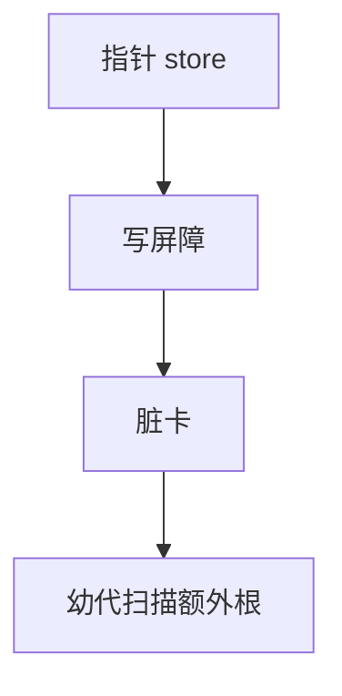
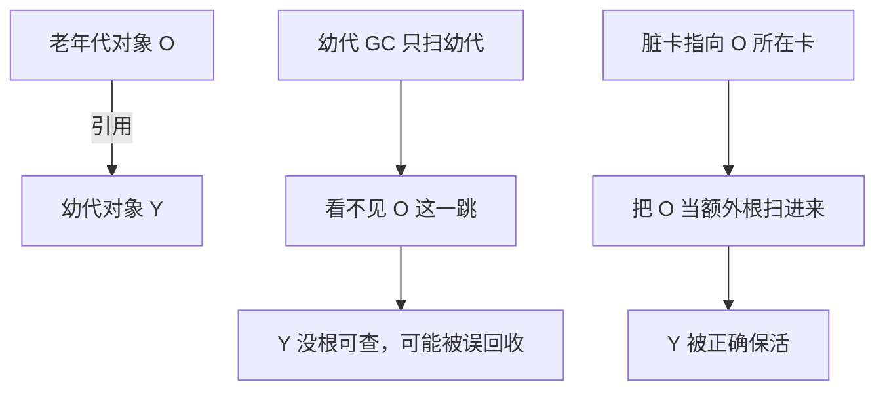

# 写屏障与卡表

分代或增量 GC 不能每次扫描全堆。写屏障在指针写入时记录「脏」：老→幼的引用进记忆集，卡表用一字节标记一页有写。

<footer>—— 据 Ungar, Generation Scavenging；Wilson and Moher；Jones 手册；HotSpot 卡表实践整理</footer>

上一课[引用计数](/cs/refcounting-gc) 在赋值处做事。追踪式分代也在赋值处做事，但目的不同：**记住跨代指针**。缺口是写屏障与卡表。并发 GC 下一课还要用屏障维持三色。主干分代课已给「幼代多死」。

## 问题

只扫幼代：必须知道老年代谁指向幼代，否则漏标。记忆集：精确到对象或到卡（512B）。写屏障：`*p=q` 时若 p 老 q 幼则标脏。缺口是**这笔商店税**，不是 RC 循环。

术语翻译：记忆集就是 GC 的「欠账本」，记录哪些外部位置可能指向幼代。做到对象粒度叫精确记忆集；做到卡（常 512 字节）粒度叫卡表——粒度粗了要多扫一些点，但维护便宜，是笔精度换速度的交易。

JIT 必须在每条指针 store 插屏障（可优化消除显然的同代）。

### 卡表不是 CPU cache

card table 是 GC 数据结构。不要和 cache line 混，尽管大小常按页/卡对齐。

Ungar 1984。HotSpot 卡表。Jones 手册分代章。本课不写全部 SATB/G1 细节，并发课再接。

## 方法

每卡一字节。store 置脏。幼代 GC：扫脏卡找跨代指针当根。清理脏位。

```mermaid
flowchart TD
  ST["指针 store"] --> WB["写屏障"]
  WB --> CARD["脏卡"]
  CARD --> YGC["幼代扫描额外根"]
```

与[别名](/cs/alias-analysis)：屏障消除需证明 store 不创跨代——难，常保守插。

为什么重要：JIT 生成的每条指针 store 都要带屏障代码。漏插一条，程序不报错、只是某次 GC 后指针悄悄悬空——这类 bug 难复现、难定位，比每条 store 多几条指令的代价严重得多，所以实现普遍选择保守多插。

## 机制

假共享：多线程写邻接卡。字节卡有意减小。不要漏屏障：漏则漏回收或悬空，比多一次屏障更糟。

一条漏标的跨代指针会出什么事：

```mermaid
flowchart TD
  OLD["老年代对象 O"] -->|"引用"| YOUNG["幼代对象 Y"]
  YGC["幼代 GC 只扫幼代"] --> SEE["看不见 O 这一跳"]
  SEE --> RISK["Y 没根可查，可能被误回收"]
  CARD["脏卡指向 O 所在卡"] --> FIX["把 O 当额外根扫进来"]
  FIX --> SAFE["Y 被正确保活"]
```

读屏障：复制式移动时读要跟随转发，或 Brooks 屏障。点名，并发课用。

直觉类比：卡是 512 字节的一格，两个线程恰好写相邻两个对象，就被记进同一张「脏卡」，下次 GC 得把整格重扫——这就是卡粒度的假共享。字节卡就是把格子开小一点，少殃及无辜。

## 边界

本课不写完整并发算法。后课默认：分代靠写屏障+记忆集。下一课并发与增量 GC。

也不把屏障当 CPU 内存屏障的全部（有重叠：store 顺序），内存模型后课。

## 小结

- 写屏障记录对 GC 重要的指针写。
- 卡表近似记忆集，幼代扫脏卡。
- JIT 必须生成屏障；漏则不正确。
- 出处：Ungar；Jones 手册；HotSpot 卡表。
