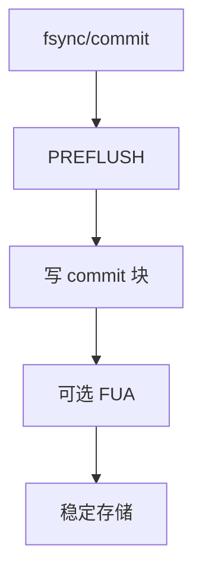

# 写屏障与 FUA

屏障要求「之前的写先于之后的写」到达稳定点；FUA 要求这一条请求自己到达介质，而不只是控制器缓存。

<footer>—— 据 Linux 块层对 flush/FUA 的说明；NVMe 与 SCSI SYNCHRONIZE CACHE / FUA 位；POSIX fsync 的设备侧对应</footer>

[上一课](/cs/blkio-cgroup)不改变完成含义。[fsync](/cs/fsync) 与 [日志](/cs/ext4-journal) 最终要变成设备命令。缺口是 **flush 与 FUA**：写缓存、乱序、以及 RAID 写洞为何仍可能发生。

## 问题

磁盘有易失写缓存。`WRITE` 完成可能只到缓存。崩溃则乱序。旧内核用「屏障请求」把队列切开；今日常用：需要时下发 `FLUSH`（NVMe flush / SCSI sync cache），或给写带 FUA（Force Unit Access）。缺口：FS 何时发（commit 块、日志超块）；合并与调度器不能把 flush 越过；禁用写缓存则 FUA 可变便宜。本课不把每家 SSD 的假完成丑闻写成附录主文，只承认硬件可能谎报。

REQ_PREFLUSH 先刷缓存再写；REQ_FUA 这条要到介质。两者可组合。电池后备缓存把它们变成几乎空操作——假设电池真有电。

## 方法

JBD2 commit：数据（ordered）先下，再 commit 块带 flush。ZFS uberblock 写同样要求持久顺序。驱动把标志译成 NVMe/SCSI 命令。对照 [轮询](/cs/io-polling)：flush 仍是一条命令，只是完成用 poll 收。对照 DAX：没有这条 bio，用 clwb。

## 机制

屏障/FUA 把「块层完成」接到「掉电可恢复」的假设上。没有它们，日志重放可能看见未来的根、过去的叶。不要把标志当成数据库隔离级别。与 [dm-crypt](/cs/dm-crypt)：flush 必须穿透映射表传到真正介质。

写洞：RAID5 的数据和奇偶即使各自 FUA，若没有条带原子，洞仍在——FUA 不是跨块事务。

实现上：禁用驱动写缓存后 flush 变便宜，但不是所有固件都真关。virtio 的 flush 若宿主忽略，客户 fsync 是空的。文件系统把标志打在 bio 上，映射层必须向下传。 读法上只引用[上一课](/cs/blkio-cgroup)的结论，不把对象换成训练推理或限价簿。

本课在操作系统进阶的「存储栈 / 块层到设备」课序里，对象是 **写屏障与 FUA**。

- 先修只引用，不重导：上一课的结论当公理，本课只补差。
- 五栏不吞并：不把本课写成大模型训练/推理，也不写成限价簿或权重量化。
- 文献用 OSTEP、McKusick、内核文档与具名会议论文；不发明 arXiv 编号。

## 边界

本课不引入 SCSI 保护信息。不保证 virtio 的 flush 在宿主机侧被正确实现——虚拟化后课会再遇。下一课空闲块通知：discard 与 TRIM。

版本字段会变，课序钉的是机制对象「写屏障与 FUA」，不是某一主线内核的结构体名。
后课默认：持久顺序靠 flush/FUA 传到介质。FS 如何告诉 SSD 哪些块不再有效，下一课 TRIM。

## 小结

- flush 刷控制器缓存；FUA 强制该请求到介质。
- 日志提交依赖它们；RAID 写洞仍要另管。
- discard/TRIM 是下一课。
- 出处：Linux block；NVMe；SCSI SBC；*OSTEP* 对 fsync 的设备侧。
