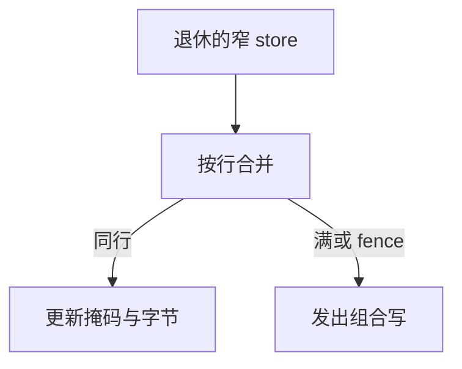

# 写合并缓冲

连续的窄 store 不必每次占一条总线事务；在缓冲里把同一行的字节拼齐，再按整行或扇区写出去。

<footer>—— 据 Intel 软件开发者手册对 write-combining 的描述；Hennessy and Patterson, CA:AQA 整理</footer>

[上一课](/cs/line-size-sector) 允许按扇区传输。store 路径上还有更细的东西：图形、DMA、非缓存映射的帧缓冲常常是一串 4–8B 写。若每条都按 [MESI](/cs/mesi-protocol) 升级整行，带宽与作废都浪费。本课不重选行大小。缺口是**写合并缓冲（WCB / WC）：在离开核之前把同行字节合并。**

## 问题

UC 或 WC 内存类型上，store 不进 L1 常规写分配，否则会污染 cache。[退休](/cs/retire-precise-exception) 后 store 仍要变成对设备或 DRAM 可见。逐条发 8B 事务，互联效率极差。缺口不是压缩，而是**按物理行地址聚合未完成的 store，掩码记录哪些字节有效，满了或 fence 时一齐发出。**

x86 的 WC 内存类型允许写合并与弱序；fence / 串行化指令会冲刷合并缓冲。这是微结构缓冲，也是内存模型可见的宽松点。

## 方法

若干项，每项：行地址、字节掩码、数据。退休 store 若地址匹配则并入；否则分配新项或逐出最旧项。逐出：按掩码发写组合事务（或先读-改-写若协议要求）。fence、I/O、过深依赖则 drain。

## 机制

对 cacheable 写回内存，常规 SQ + 写分配已经在行内合并；WCB 的主战场是 WC/UC 与某些 streaming store。与 [LSQ](/cs/lsq-disambiguation)：转发规则在 WC 区域更弱，程序员不能假设马上被后续 load 看见——这是模型课与 fence 课的接口，本课只要求缓冲在 drain 前可以乱序发出不同行。

GPU 的 store buffer / 合并单元更激进，后课合并访存会再遇到「按行拼事务」，先在 CPU 侧把 WCB 钉住。

## 边界

本课不把 DMA 描述符环的驱动写法展开。也不把事务内存的写集合当成 WCB。fence 的代价下一单元末才专讲；这里只承认 drain 是正确性点。TLB 多级是下一课：合并用的是物理行地址，必须已经翻译完。

后课默认：窄 store 可以在核边合成较宽的写。翻译本身有层次，下一课 TLB 与 PWC。

## 小结

- 写合并把同行窄 store 合成一次事务，主要用于 WC/UC 与流式写。
- fence 与缓冲满会强制 drain。
- 多级 TLB 与页表缓存是下一课翻译层次。
- 出处：Intel SDM（WC）；Hennessy and Patterson, *CA:AQA*。
