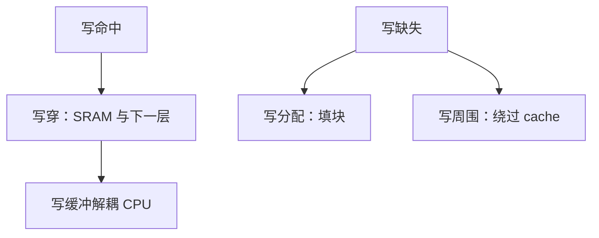

# 写穿与写周围

每次写都推到下一层，层次之间不长期分叉；写缺失若绕过 cache，一次性存储就不会把有用块挤掉。

<footer>—— 据 Patterson and Hennessy, Computer Organization and Design (RISC-V)；Hennessy and Patterson, CA:AQA 整理</footer>

[上一课](/cs/write-back-allocate)把写回加写分配钉成后课默认，并点名写直达与不分配常成对。本课不重讲脏位。缺口是把另一对策略写清楚：写穿（写直达）如何用写缓冲躲开 DRAM 延迟，以及写周围（不分配）何时避免污染。本课是对照，不推翻默认。

## 问题

写回让 SRAM 比 DRAM 新，单核看不见，DMA 与多核立刻看见。[一致性问题引入](/cs/coherence-intro)还在后面。有的层次——尤其指令 cache 旁的数据写入、或极简嵌入式核——宁愿**每次 store 都更新下一层**，省掉脏位与写回事务。写缺失若仍分配，一块只写一次的轨迹会踢掉热块。缺口不是再定义标签，而是写穿路径与写周围规则。

写周围 = 写不分配：缺失的 store 直接去下一层，cache 不填块。读缺失仍分配。

## 方法

写穿：写命中时同时写 SRAM 与下一层（或只保证下一层会得到该字）。脏位可省。CPU 等 DRAM 完成则 CPI 崩；中间加写缓冲：store 把地址与数据放入队列即可提交，缓冲自己排到总线。

写周围：写缺失不填 cache。适合「写一次、不再读」的流。若随后马上读同一块，会再付一次读缺失——与写分配的交易。

后续 load 必须探测写缓冲：命中则转发，否则可能读到旧 DRAM。上一课承认缓冲存在；本课把它当成写穿能用的前提。

## 机制

写穿的流量按 store 次数计，写回按脏块驱逐计。写密集且每块只写一字节时，写穿更差；块上多次写再驱逐时，写回合并。指令 cache 通常只读，不参与这套；I/D 分离后，数据写穿仍可能要作废指令行——一致性课再收。

简单多核：写穿让下一层（或总线）总有最新字，窥探可只听写事务。这不代替 MESI，只是协议可以更瘦。主干数据 cache 仍默认写回。

## 边界

本课不引入 MSHR，不把写结合（write combining）当成第三种主策略——它是缓冲上的合并优化。也不把页的脏位与 cache 写穿混名。后课缺失分类把写缺失计入轨迹时，须声明用的是分配还是周围。

后课默认：数据 cache 仍是写回加写分配；写穿加写周围作为对照与写缓冲注脚。谈到缺失，按三类拆。

## 小结

- 写穿每 store 更新下一层，靠写缓冲藏延迟；可省脏位。
- 写周围在写缺失时不填块，避免一次性写污染。
- 主干默认仍是写回；缺失分类是下一课。
- 出处：Patterson and Hennessy, *COD* RISC-V；Hennessy and Patterson, *CA:AQA*。
