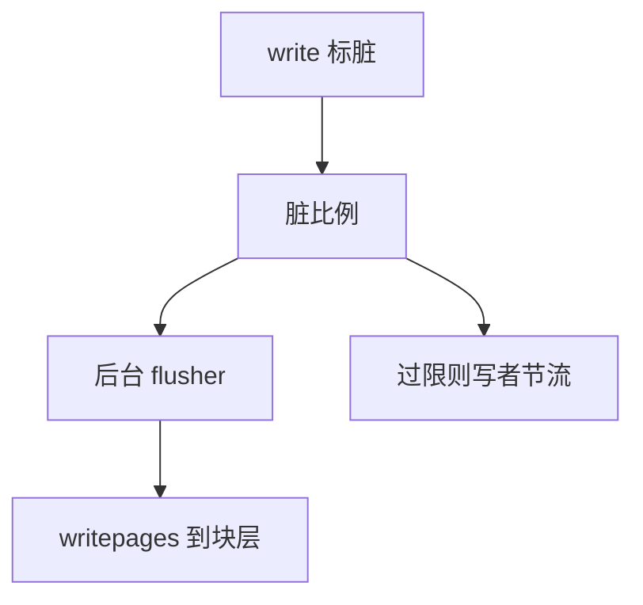

# writeback

脏页不在每次 write 时落盘；后台按比例与老化把它们排成回写，平衡吞吐与崩溃窗口。

<footer>—— 据 Silberschatz 对延迟写的讨论；Love 对 Linux 写回的整理</footer>

[上一课](/cs/page-cache)把脏位置在页上。[缓冲与脏页](/cs/buffer-dirty) 说回写可由定时器、压力或 fsync 触发。缺口是**策略引擎**：脏比例、过期时间、flusher 线程、以及与 [内存回收](/cs/memory-reclaim) 抢同一套 LRU 时谁先写。不是磁盘电梯——那是更后的块层。

## 问题

写回太勤，随机小写变成同步盘；太懒，崩溃窗口大，且回收时才发现全是脏页、分配卡死。缺口：维护脏页数量与阈值（如脏占内存比例）；超过后台阈值则 flusher 写；超过限制阈值则写者自己同步写（dirty throttling）。按 inode 或按 bdi（backing device）排队，避免一个文件饿死其他设备。

本课不把每版 `dirty_ratio` 的默认整数当考纲。

老化：页脏了多久。老脏页优先，减少「永远不刷的冷脏页」。laptop 模式可把回写攒成突发以让盘休眠。

## 方法

`write` 只改页 Cache 并记账。kupdate/flusher：选过期或超额的 inode，调用 [VFS](/cs/vfs) 的 `writepages`。回收路径上若碰到脏文件页，先加入回写再等完成或换一个牺牲。与 swap 写回并列但目标不同：这里写文件，不是槽。完成中断后清脏位。

## 机制

writeback 把延迟写收成可调的控制环，让 [调度](/cs/scheduling-metrics) 看到的 I/O 等待成批出现而不是每次 `write`。它不提供 `write` 返回即持久——那是下一课 fsync。崩溃时未刷的脏页丢失，正是窗口的含义。不要把组提交的数据库日志提前写进本课；文件系统日志在更后。

## 边界

本课不引入 cgroup 写回带宽限制的全文。不保证 SSD 上「老化」仍有机械盘那种意义，但节流仍防写爆。下一课用户要一条系统调用等待「与此文件相关的脏页到达稳定介质」。

后课默认：回写是尽力的、异步的。显式持久是 fsync。

## 小结

- flusher 按脏比例与老化写回页 Cache。
- 过限则写者阻塞，避免内存被脏页填满。
- 单文件持久等待是 fsync 的缺口。
- 出处：Silberschatz et al., *OSC*；Love, *LKD*；Tanenbaum *MOS*。
