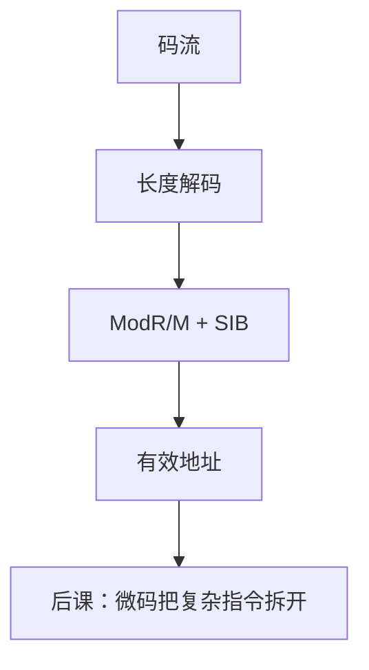

# x86-64 编码与寻址

  
指令长度从 1 字节到 15 字节不等：前缀、REX、ModR/M、SIB、位移与立即数拼出有效地址，译码是状态机，不是 RISC 的固定切片。

  <footer>—— 据 Intel 64 and IA-32 Architectures Software Developer’s Manual；Patterson and Hennessy, Computer Organization and Design 整理</footer>

[上一课](/cs/bios-uefi)把控制交给加载器时，x86 上跑的是变长机器码。[RISC 与 CISC](/cs/risc-cisc) 已对照原则。缺口是 **x86-64 编码**：REX 前缀把寄存器扩到 16 个，RIP-relative 寻址服务 [PIC](/cs/pic)，ModR/M+SIB 表达复杂有效地址。本单元对照 ISA，不重写 Transformer，不进限价簿。

## 问题

RV32I 定长 32 位字段。[整数指令](/cs/riscv-int-isa) 语义清晰。x86-64：遗留 8/16/32 位模式叠 64 位，前缀改宽度与段，ModR/M 的 mod/reg/r/m 决定是寄存器还是 `[base+index*scale+disp]`。缺口不是再讲 RISC 原则，而是这套**变长码流**如何切出下一条指令——边界识别本身就要顺序扫描。

寻址：多数运算可带一个内存操作数（CISC）；64 位下默认 RIP-relative 的 `disp32` 便于 PIC。栈用 `rsp`，调用约定后课 ABI 边界再与 SysV 对齐。

### 变长不是「随便多长」

最大 15 字节，超长不合法。把 x86 理解成比特流任意切，译码器会失同步（恶意指令流攻击是安全课）。长度解码要先吞前缀再看 opcode map。

Intel SDM 卷 2 是编码权威。AMD 兼容手册对照。Patterson/Hennessy 用 CISC 对照教学。本课不背全部 opcode 图。

## 方法

取指：从 RIP 读字节，长度解码器输出下一条边界。有效地址：段基（64 位大多平坦）+ base + index×scale + disp。REX.W 选 64 位操作数，REX.R/X/B 扩展寄存器号。立即数跟在寻址字节后。

与 [DMA](/cs/dma-scatter-gather) 无关：这是 CPU 取指。固件复位后先在 16 位实模式编码里，再进长模式——启动链已点过。

## 机制

下一课微码：一条 CISC 变成多条 μop，内部更像 RISC。本课只让「指令从哪几个字节来、内存操作数地址怎么算」可讲。ARM/RISC-V 对照课会回来比密度与译码成本。

## 边界

本课不列 SSE 前缀全部，不把 VEX/EVEX 当本课主体（SIMD 课再接）。不写每条 legacy 指令的微码长度表。

后课默认：x86-64 是变长编码加 ModR/M 寻址；RIP-relative 是 64 位 PIC 的常用形。

## 小结

- 变长：前缀 + opcode + ModR/M/SIB + disp/imm。
- 一条指令可带内存操作数；RIP-relative 服务 PIC。
- 译码要顺序确定长度。
- 出处：Intel SDM；Patterson and Hennessy, COD；RISC-CISC 先修。
