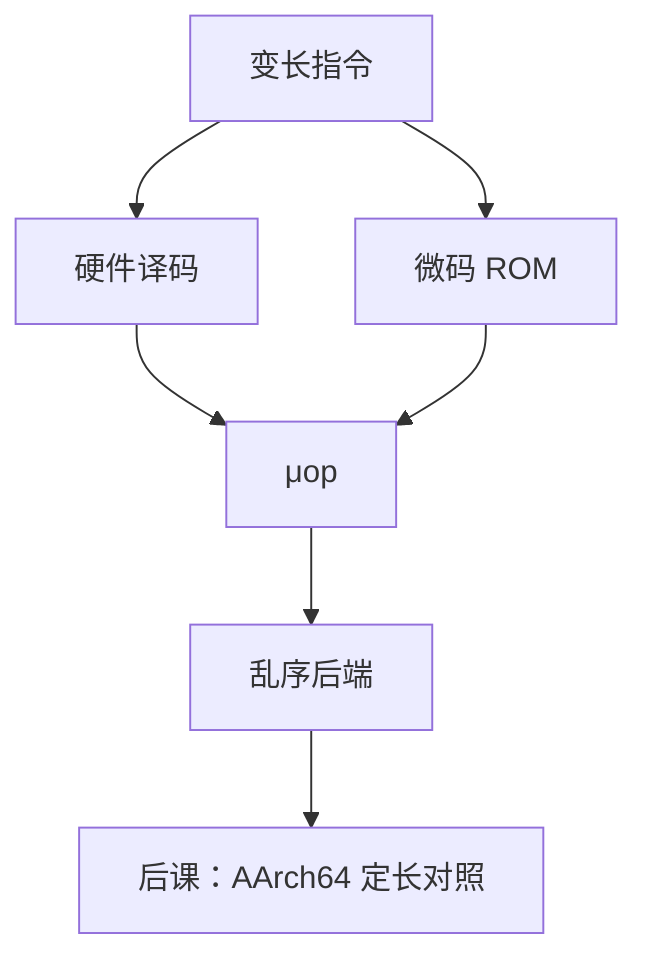

# x86 微码与译码

  
程序员看见 CISC；内核看见的是微操作：简单指令直译成一条或几条 μop，复杂的走进微码 ROM 展开成序列。

  <footer>—— 据 Intel SDM；Hennessy and Patterson, CA:AQA；Patterson and Hennessy, Computer Organization and Design 整理</footer>

[上一课](/cs/x86-64-encoding)切出变长指令。组成课[多周期与微程序](/cs/multicycle-microcode)已有微码直觉。缺口是当代 x86：**译码器 + 微码 ROM + μop 缓存**，让后端可以是乱序 RISC 数据通路，而不把 ISA 改成 RISC-V。

## 问题

`add rax, rbx` 可直出一条 μop。`rep movsb`、特权指令、远调用走微码：ROM 里存 μop 序列，类似教学微程序。缺口不是 ModR/M 字段，而是**分层**：ISA 稳定，微架构用 μop 做寄存器重命名与执行端口。译码带宽（每拍几条 x86 指令）是前端瓶颈，μop 缓存命中可跳过长度解码。

微码可打补丁（MSR 加载），修正错误，也扩大信任基——本课点名，安全课再收。

### 微码不是「操作系统」

它不调度进程，不解释 Python。把微码当第二内核，特权模型会混。用户态仍执行 ISA；微码只在该指令的实现里跑，不开放通用编程接口。

CA:AQA 讨论 x86 前端与 μop。Intel 披露有限；教学以「CISC 外壳、RISC 内核」为准。Patterson/Hennessy 微程序章是祖先。

## 方法

前端：长度解码 → 译码器（简单路径）或微码测序器。μop 进 IDQ，后端乱序。宏融合（cmp+jcc）点名。与 RISC-V：后者译码组合，无 ROM 常规路径（实现仍可微码化罕见指令）。

[STA](/cs/sta) 不管 μop；那是硅已定的时序。本课是 ISA–微结构界面。

## 机制

后课 ARM 也有复杂指令的微码化，但 AArch64 定长让前端简单得多。原子与 fence 会变成带特殊内存序的 μop。SIMD 一条指令多 μop 或一个宽执行端口。本课钉 x86 前端合同。

## 边界

本课不给某代译码器宽度的保证数字，不逆向微码。不把「微码更新」写成用户作业。不讨论专利史。

后课默认：x86 指令被译成 μop；复杂路径走微码 ROM；后端按 μop 调度。

## 小结

- 变长 ISA 靠译码器/微码变成 μop 流。
- 简单指令直译；复杂指令 ROM 展开。
- RISC-V 前端通常无此层。
- 出处：Intel SDM；Hennessy and Patterson, CA:AQA；Patterson and Hennessy, COD。
