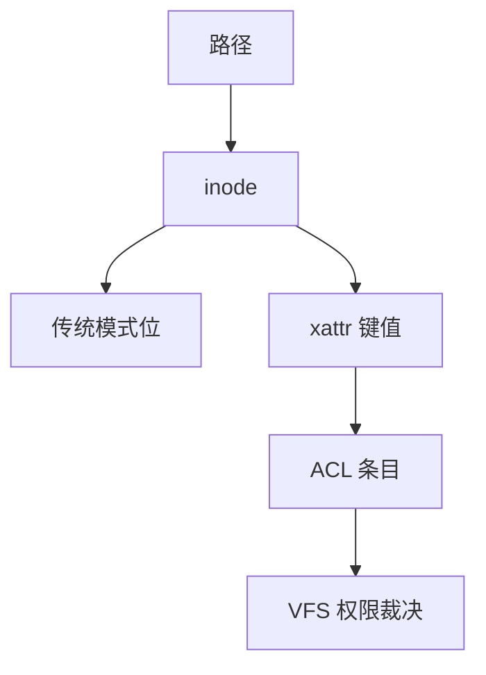

# 扩展属性与 ACL

inode 上除了模式位，还可以挂键值对；ACL 把「谁能对这个对象做什么」写成可列举的条目，而不只是 ugo 三位。

<footer>—— 据 POSIX ACL 草案与 NFSv4 ACL 实践；Linux xattr 文档；McKusick 对扩展属性存放的讨论</footer>

[上一课](/cs/sparse-files)把数据洞说清。元数据仍停在 [inode](/cs/inode-dir) 的模式、uid、gid。缺口是 **xattr**：任意名空间里的键值；以及用它（或并行结构）实现的 ACL。本课不把 SELinux 标签的策略写成安全课全文——那是 LSM 后课。

## 问题

备份系统、SELinux、capabilities 落地、用户注释都需要「不进文件字节」的旁路数据。若全塞进目录项，FAT 那样的定长槽放不下。Unix 把扩展属性挂到 inode：`user.*` 可用户写，`security.*`、`system.*` 受特权约束。POSIX ACL 常存在 `system.posix_acl_access` 等键里。缺口：查找路径上要不要继承默认 ACL；权限检查在 VFS 还是 FS；与 [VFS](/cs/vfs) 操作表如何接头。

属性值可放 inode 内联或外置块。列表过大则 `listxattr` 昂贵。ACL_MASK 与 named user 的计算顺序是规范细节，课序只要求「模式位不是唯一裁决」。

## 方法

`setxattr`：VFS 检查名空间权限，调 FS 把键值写入 inode 旁路块或内联区，可能进 [日志](/cs/ext4-journal) 事务。`getxattr` 读回。打开文件时，若启用 ACL，VFS 用 ACL 条目代替简单 `mode & umask` 裁决。拷贝文件若不用 `cp --preserve=xattr`，属性会丢——这是用户工具问题，对象仍在 inode 上。

## 机制

xattr 让文件系统成为可扩展的对象存储：安全模块、overlay 白名单、能力集都可以不改盘格式主结构。ACL 把「组不够用」从二次开发里收回内核。不要把 ACL 写成数据库行级安全：没有 SQL，只有对 inode 的访问谓词。

与 FAT：若干实现把 ACL 塞进 EA 流，仍是目录项旁路，不是 Unix inode 号。NFS 是否传送 ACL 是 [NFS 语义](/cs/nfs-semantics) 的缺口，本课只钉本地 VFS。

实现上：POSIX ACL 的 mask 项会截断 named user/group 的有效权限，只看 mode 的 group 位会误判。security xattr 给 LSM 用，user xattr 可被配额计入数据块。 读法上只引用[上一课](/cs/sparse-files)的结论，不把对象换成训练推理或限价簿。

本课在操作系统进阶的「文件系统实现 / 布局与日志」课序里，对象是 **扩展属性与 ACL**。

- 先修只引用，不重导：上一课的结论当公理，本课只补差。
- 五栏不吞并：不把本课写成大模型训练/推理，也不写成限价簿或权重量化。
- 文献用 OSTEP、McKusick、内核文档与具名会议论文；不发明 arXiv 编号。

## 边界

本课不引入 RichACL 的全部 NFSv4 权限位。不保证每个导出的 FUSE 都实现 xattr。下一课用同一套 inode 记账：配额何时在分配路径上扣减。

版本字段会变，课序钉的是机制对象「扩展属性与 ACL」，不是某一主线内核的结构体名。
后课默认：inode 可挂键值与 ACL。用户与项目的空间/inode 上限，下一课配额。

## 小结

- xattr 是 inode 旁路键值；ACL 常存在其中。
- VFS 在打开与创建路径上用 ACL 裁决。
- 配额是下一课。
- 出处：POSIX ACL；Linux `xattr(7)`；McKusick；NFSv4 ACL 概述。
