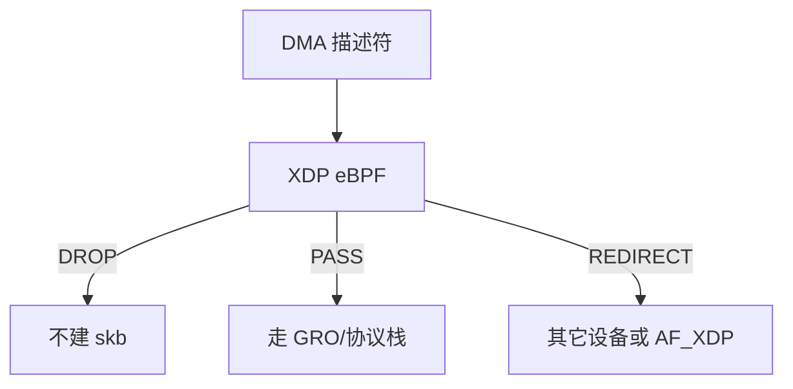

# XDP 与 eBPF 网络

XDP 在驱动 DMA 之后、skb 分配之前运行 eBPF：可以丢包、改包、重定向，用更少的每包开销做数据面。

<footer>—— 据 Linux XDP 文档；Høiland-Jørgensen 等对 XDP 的论述；eBPF 网络钩子说明</footer>

[上一课](/cs/bridge-tun-tap)留下的缺口接到本课。 [NAPI](/cs/napi) 建 skb 已经贵。[netfilter](/cs/netfilter-conntrack) 更在 skb 之后。缺口是 **XDP**：可编程、早、可 JIT，对象仍是包，不是大模型推理。

## 问题

DDoS 小包：CPU 死在分配 skb。XDP 程序看以太网/IP/TCP 头，返回 DROP/PASS/TX/REDIRECT。PASS 才走普通 RX。缺口：verifier 保证程序终止与内存安全；map 做计数与黑名单；与 tc eBPF、socket filter 的挂钩点不同。本课不把 verifier 算法写成编译课。

generic XDP 在 skb 之后跑，方便无驱动支持，但失去早丢的意义。驱动 native/offload 才是本课动机。

## 方法

加载：`bpf(2)` 把程序挂到 `netdev`。poll 路径：`bpf_prog_run_xdp`。重定向到另一设备或 AF_XDP 套接字进用户态。对照 [FUSE](/cs/fuse)：都是「内核把事件交给可编程体」，一个是文件，一个是包。对照 iptables：XDP 更早、无 conntrack 除非自己用 map 做。

## 机制

XDP 把数据面从固定 C 路径里打开一个可验证窗口，使过滤与转发能在每核百万 PPS 上活。它不替代 TCP 状态机。不要写成 AI 包分类。与 [cgroup](/cs/cgroups)：程序可读 cgroup id，策略仍要人写。

安全：能挂 XDP 需要 CAP_NET_ADMIN 或 bpf 权限；错误程序被 verifier 拒。

实现上：AF_XDP 把 umem 注册给驱动，用户 poll 描述符，是 XDP 与 DPDK 之间的折中。verifier 禁循环（或限制迭代），复杂解析要拆 helper。offload 到网卡后调试面变窄。 读法上只引用[上一课](/cs/bridge-tun-tap)的结论，不把对象换成训练推理或限价簿。

本课在操作系统进阶的「网络栈 / 收发路径」课序里，对象是 **XDP 与 eBPF 网络**。

- 先修只引用，不重导：上一课的结论当公理，本课只补差。
- 五栏不吞并：不把本课写成大模型训练/推理，也不写成限价簿或权重量化。
- 文献用 OSTEP、McKusick、内核文档与具名会议论文；不发明 arXiv 编号。

## 边界

本课不引入所有 helper 列表。不保证网卡硬件 offload 与软件语义一致。下一课更彻底的旁路：DPDK 不经过内核协议栈。

版本字段会变，课序钉的是机制对象「XDP 与 eBPF 网络」，不是某一主线内核的结构体名。
后课默认：可在 skb 前用 eBPF 处理包。用户态驱动轮询网卡，下一课 DPDK。

## 小结

- XDP 在建 skb 前跑 eBPF，可丢可转。
- verifier 限制程序；map 保存状态。
- 内核旁路 DPDK 是下一课。
- 出处：Linux XDP；Høiland-Jørgensen et al.；eBPF 文档。
