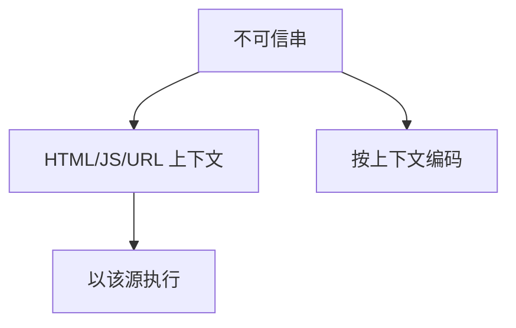

# XSS

脚本与数据若在 HTML/JS 上下文里分不开，攻击者的字符串就会在受害者浏览器里以该源的身份执行。这是注入课在 Web 上的实例：完整中介失败在页面拼接。

<footer>—— 据 OWASP XSS；CWE-79；对照[同源与 CSRF](/cs/same-origin-csrf)、[注入](/cs/injection-boundary)</footer>

## 定位

上一课[二进制加固](/cs/binary-hardening-obfuscation)结束软件安全。Web 单元从浏览器开始。主干同源课管 Cookie；缺口是**脚本注入**：反射、存储、DOM。不给可复制的恶意脚本。

后课默认已经读完本课钉下的合同，只补差，不从该领域第一性原理重开。

## 问题

模板把用户输入写进 HTML。若未按上下文编码，输入可变成标签或事件处理器。存储型让每位访客执行。缺口是上下文编码与可信类型，不是过滤尖括号清单。

### 不是只防 script 标签

事件属性、CSS、URL 方案都是上下文。编码函数必须匹配上下文。

OWASP。本课禁止 XSS payload 教程。CSP 下一课是纵深，不是根治。

## 方法

分三种 XSS。防御：模板自动转义、Trusted Types、HttpOnly 不阻止 XSS 操 DOM。下一课 CSP 限制脚本源。

图中节点是本课的机制骨架；课程不把图展开成可运行的攻击步骤。

## 机制

SOP 把脚本权限给源。XSS 等于把权限借给输入。会话 Cookie 可被同源于脚本读（除非 HttpOnly，但仍可发请求）。

前提写进合同之后，游戏外的误用只当失败模式点名，不在本课写成操作程序。

## 边界

零 payload。CSP 下一课。

## 小结

- 内存利用之后，Web 的经典注入是 XSS。
- 按上下文编码；过滤清单不够。
- XSS 借用源的权限。
- 下一课 CSP。
- 出处：OWASP XSS；CWE-79；[injection-boundary](/cs/injection-boundary)。
