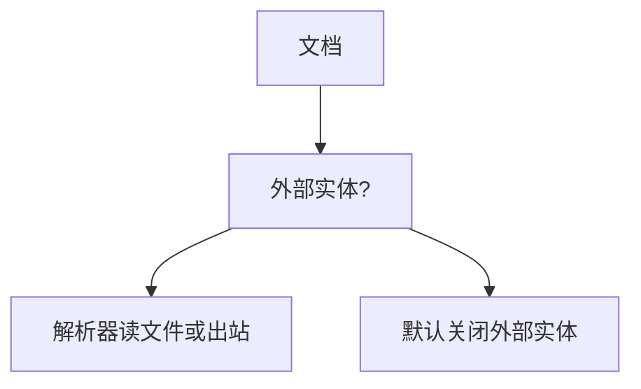

# XXE

XML 外部实体让解析器在处理文档时去读文件或发请求。若解析器开了不应开的特性，输入文档就变成 SSRF 与本地读取的开关。默认应关掉外部实体。

<footer>—— 据 CWE-611；OWASP XXE；XML 规范中的实体</footer>

## 定位

上一课[命令注入](/cs/command-injection)是壳。缺口是 **XML 解析器特性**。本课讲实体与默认加固，不给实体 payload。

后课默认已经读完本课钉下的合同，只补差，不从该领域第一性原理重开。

## 问题

DTD 可定义外部实体。解析时替换导致读本地或出站。SOAP 与旧 XML API 常见。缺口是解析器配置：禁 DTD、禁外部。

### 实体膨胀

内部实体膨胀是可用性，与外部实体的保密不同轴。

CWE-611。禁止 XXE payload。Web 竞态下一课换时间轴。

## 方法

检查库默认。JSON 替换 XML 减少这面。下一课 Web 竞态与 TOCTOU。

图中节点是本课的机制骨架；课程不把图展开成可运行的攻击步骤。

## 机制

解释器再次把数据当控制。SSRF 课的出站在此由解析器触发。竞态下一课是时间上的检查与使用。

前提写进合同之后，游戏外的误用只当失败模式点名，不在本课写成操作程序。

## 边界

零实体样例当作业。Web 竞态下一课。

## 小结

- 壳之后，XML 实体是另一解释器。
- 默认禁外部实体与 DTD。
- 膨胀 DoS 与外部读取分轴。
- 下一课 Web 竞态。
- 出处：CWE-611；OWASP XXE。
