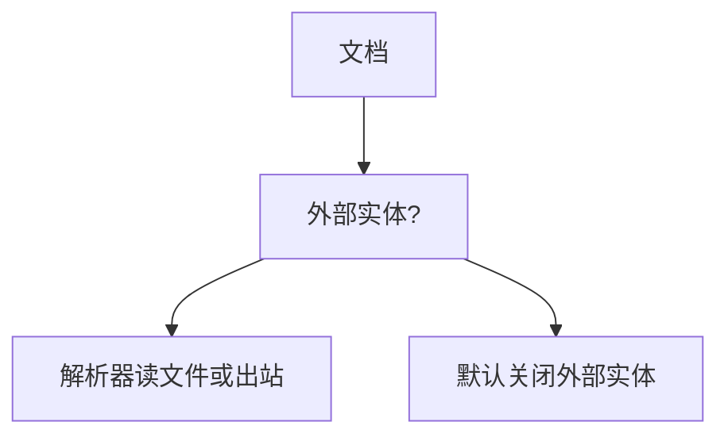

# XXE

XML 外部实体让解析器在处理文档时去读文件或发请求。若解析器开了不应开的特性，输入文档就变成 SSRF 与本地读取的开关。默认应关掉外部实体。

<footer>—— 据 CWE-611；OWASP XXE；XML 规范中的实体</footer>

上一课[命令注入](/cs/command-injection)的元凶是壳解释器；本课的缺口是另一个解释器的特性——**XML 解析器**的实体替换。本课讲实体机制与默认加固，不给 payload。

后课默认已经读完本课钉下的合同，只补差，不从该领域第一性原理重开。

## 问题

XML 的 DTD 允许定义外部实体：文档内声明一个指向 file:// 或 http:// 的实体，解析器替换时就地去读本地文件或发出请求——一份输入文档变成 SSRF 与本地文件读取的开关。SOAP 服务与旧 XML API 里常见。缺口是解析器配置：禁 DTD、禁外部实体，且必须核对所用库的默认值——历史上的大量 XXE 漏洞恰恰是默认开着。

### 实体膨胀

实体膨胀（billion laughs）是另一条轴：纯内部实体的指数嵌套就耗尽解析器内存，属可用性；外部实体是保密与 SSRF。两轴分开治。

CWE-611。禁止 XXE payload。Web 竞态下一课换时间轴。

## 方法

方法第一步是核对库默认：升级解析器、显式关闭 DTD 与外部实体、限制实体展开层数。结构上，能用 JSON 替换 XML 就少背一块这样的特性面。下一课 Web 竞态与 TOCTOU。

```mermaid
flowchart TD
  XML["文档"] --> DTD["外部实体?"]
  DTD --> IO["解析器读文件或出站"]
  DTD --> OFF["默认关闭外部实体"]
```

## 机制

机制仍是老主题的新解释器：数据被当成控制——DTD 本是文档内容（数据），却指挥解析器做 I/O（控制）。与[命令注入](/cs/command-injection)的差别只在解释器换成 XML 解析器；SSRF 课里的出站请求在这里由解析器触发，出站管控要把解析器算进调用方。竞态下一课是时间轴上的检查与使用。

## 边界

不给实体样例当作业；边界要点名：SAML、SOAP 这类协议离不开 XML，加固要在解析器与 schema 层做，换格式逃避不总是选项。Web 竞态下一课。

## 小结

- 壳之后，XML 实体是另一解释器。
- 默认禁外部实体与 DTD。
- 膨胀 DoS 与外部读取分轴。
- 下一课 Web 竞态。
- 出处：CWE-611；OWASP XXE。
