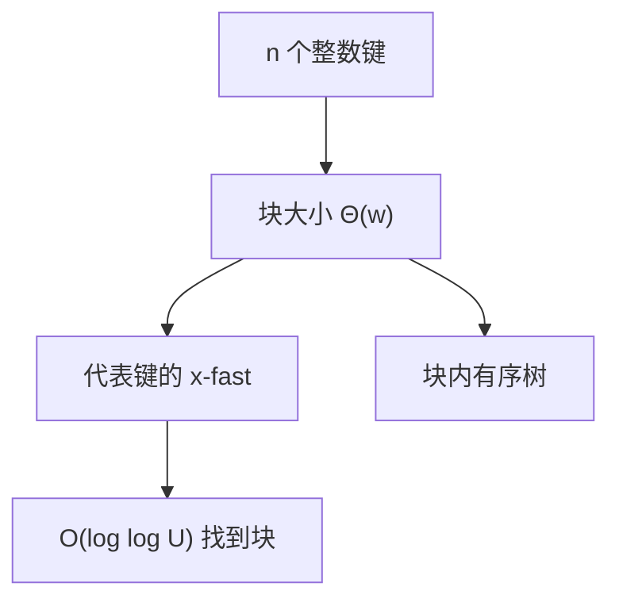

# Y-fast trie

x-fast 用分层哈希存前缀；y-fast 把键分成 $\Theta(\log U)$ 大小的块，块代表进 x-fast，块内平衡树，空间回到 $O(n)$。

<footer>—— 据 Willard, Log-Logarithmic Worst-Case Range Queries are Possible in Space $\Theta(N)$, IPL 1983；Cormen, Leiserson, Rivest and Stein 整理</footer>

[上一课](/cs/van-emde-boas) 的 $O(\log\log U)$ 漂亮，朴素空间随 $U$ 涨。本课不重写 summary 簇。缺口是 Willard 的 y-fast trie：先理解 x-fast（每层前缀哈希 + 叶链表），再把连续 $\Theta(w)$ 个键收成代表，使哈希表项 $O(n)$。

## 问题

x-fast trie：对每个已插入键的全部比特前缀建哈希，层 $i$ 查 $x$ 的 $i$ 位前缀是否存在，二分深度得最长匹配，再跳到后继叶。时间 $O(\log w)=O(\log\log U)$，空间 $O(n\log U)$（每键 $w$ 个前缀）。y-fast：叶层不存全部键，而存每块的最大（或代表）键，块内 BST 大小 $\Theta(w)$。缺口是**用一块代表换掉每键每层前缀**，空间 $O(n)$，时间仍 $O(\log\log U)$ 期望或最坏视哈希而定。

Willard 1983, *Information Processing Letters*。哈希用动态完美或通用散列时，界随哈希合同走；本课不提前写下两课散列族。

## 方法

查找后继：在 x-fast 上找代表后继，再在相邻一两块的 BST 里比。插入删除：块过大则裂，过小则并，像 B 树但块大小跟 $w$ 走。代表变则更新 x-fast 前缀。

与 vEB：y-fast 空间优；常数与哈希失败概率要写进合同。与平衡 BST：当 $n\ll U$ 且 $w$ 固定，y-fast 渐近更好，实践常数常输给 [Treap](/cs/treap)。

## 机制

最长前缀匹配是比特 trie 的标准动作；哈希让「这一层有没有这个前缀」变期望 $O(1)$。块裂并摊还 $O(\log\log U)$ 量级，分析类似 B 树加 x-fast 更新。

不要把本课写成 IP 路由硬件——那是最长前缀的应用，机制已够。

## 边界

本课不引入融合树。几何区间 stabbing 不是整数后继：下一课区间树，键是线段端点。

后课默认：整数宇宙后继可用 y-fast 换空间。轴对齐区间的stabbing 用区间树。

## 小结

- x-fast：$O(n w)$ 空间，$O(\log\log U)$ 后继。
- y-fast：分块代表，空间 $O(n)$。
- 下一课从一维整数换到区间几何。
- 出处：Willard, *IPL*, 1983；Cormen et al.。
