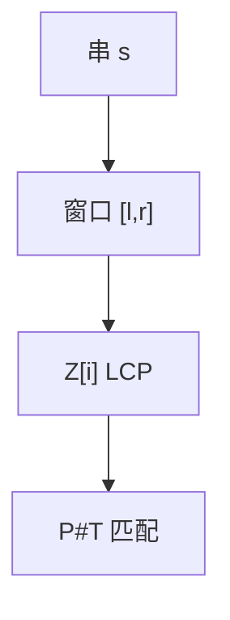

# Z 函数

$Z[i]$ 是 $s[i..]$ 与 $s$ 的最长公共前缀；维护已匹配窗口 $[l,r]$，线性扫完，与 KMP 前缀函数互推。

<footer>—— 据 Gusfield, Algorithms on Strings, Trees and Sequences；CLRS 第 32 章对照整理</footer>

上一课[矩阵链与 Knuth 优化](/cs/knuth-opt-matrix-chain)收束 DP 进阶。本单元进入字符串。主干[KMP](/cs/kmp) 给了 $\pi$。缺口是 Z 函数：每个后缀与全串的 LCP。匹配、本质不同子串、字符串周期都用 $Z$。不重写 $\pi$ 的自匹配证明。后课 Manacher 回文。

## 问题

$Z[0]$ 约定 $0$ 或 $n$。朴素每位 $O(n)$ 比较最坏平方。Z-box：已匹配到 $r$ 的窗口。若 $i\le r$，可把 $Z[i-l]$ 与 $r-i+1$ 取 min 再尝试延长。均摊 $O(n)$：$r$ 只增。

模式匹配：算 $P\#T$ 的 $Z$，凡 $Z[i]=|P|$ 即出现。与 KMP 等价线性。

缺口是窗口，不是后缀数组（后课应用）。

### $Z$ 与 $\pi$ 互推

$\pi$ 与 $Z$ 可 $O(n)$ 互化。周期：若 $i+Z[i]=n$ 等条件给出周期。不要两套都从平方枚举起。

Gusfield 系统写 Z。KMP 1977 是 $\pi$。后课 Manacher 另用回文半径窗口。

## 方法

初始化 $l=r=0$。$i$ 从 1 到 $n-1$ 按盒内外更新。匹配用拼接串注意分隔符不在字母表。

输出 $Z$ 数组。

## 机制

$r$ 单调保证比较次数 $O(n)$。与 KMP：都是已匹配前缀的再利用。与后缀数组：LCP 是任意后缀对，本课只对对全串。与滚动哈希：Z 最坏线性确定。

## 边界

本课不写后缀自动机。不写回文（下一课）。后课默认：与自身 LCP 用 Z；$O(n)$。下一课 Manacher。

## 小结

- $Z[i]$：后缀与全串 LCP。
- Z-box 线性；可匹配、求周期。
- 与 $\pi$ 互推。
- 出处：Gusfield；KMP 见 Knuth, Morris and Pratt, 1977。
