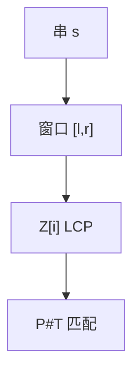
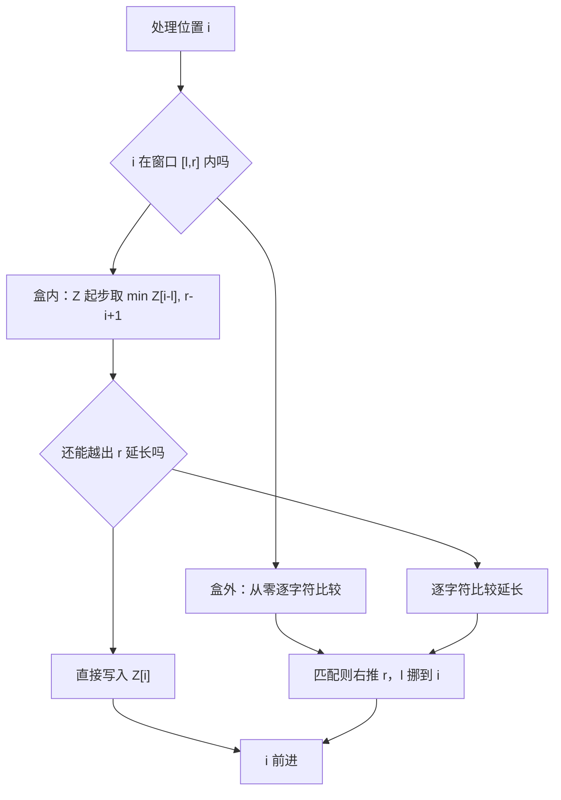

# Z 函数

$Z[i]$ 是 $s[i..]$ 与 $s$ 的最长公共前缀；维护已匹配窗口 $[l,r]$，线性扫完，与 KMP 前缀函数互推。

<footer>—— 据 Gusfield, Algorithms on Strings, Trees and Sequences；CLRS 第 32 章对照整理</footer>

上一课[矩阵链与 Knuth 优化](/cs/knuth-opt-matrix-chain)收束 DP 进阶，本单元进入字符串。主干[KMP](/cs/kmp) 给了前缀函数 $\pi$。缺口是 Z 函数：每个后缀与全串的 LCP。匹配、本质不同子串、字符串周期都用 $Z$。不重写 $\pi$ 的自匹配证明。后课 Manacher 回文。

## 问题

$Z[i]$ 记后缀 $s[i..]$ 与全串的最长公共前缀长度（$Z[0]$ 约定 $0$ 或 $n$）。朴素地对每个 $i$ 从头比较，最坏每次 $O(n)$、总 $O(n^2)$——全 a 的串就是如此。加速靠 Z-box：维护右端最远的已匹配窗口 $[l,r]$。若 $i\le r$，窗口内位置 $i$ 与位置 $i-l$ 的内容完全一致（窗口正是前缀的拷贝），于是 $Z[i]$ 先取 $\min(Z[i-l], r-i+1)$ 起步，再尝试延长——只有延长段花比较。$r$ 只增不减，均摊 $O(n)$。

模式匹配：算 $P\#T$ 的 $Z$，凡 $Z[i]=|P|$ 即出现，与 KMP 同为线性。缺口是窗口，不是后缀数组（后课应用）。

### $Z$ 与 $\pi$ 互推

$\pi$ 与 $Z$ 可 $O(n)$ 互化：$Z$ 附带每个匹配的右端点信息，$\pi$ 给 border 链式跳转，两向各一遍扫描。周期：若 $i+Z[i]=n$，即该后缀与前缀完全重合，则 $i$ 是一个周期；再整除 $n$ 时得到整周期。不要两套都从平方枚举起。

数字实例：$s = $ `aabxaab`，$i=4$ 处的后缀 `aab` 与全串 LCP 为 3，故 $Z[4]=3$；用分隔符拼成 `aab#aab`，凡 $Z[i]=3=|P|$ 即命中一次匹配——这就是 $P\#T$ 技巧的全部。

Gusfield 系统写 Z。KMP 1977 是 $\pi$。后课 Manacher 另用回文半径窗口。

## 方法

初始化 $l=r=0$，$i$ 从 1 到 $n-1$ 走两个分支：盒内按 min 起步、盒外从零比较，比较成功就右推 $r$ 并把 $l$ 挪到 $i$。匹配用拼接串时注意分隔符不在字母表，否则拼缝处可能误配，$Z[i]=|P|$ 判据失效。输出 $Z$ 数组。

```mermaid
flowchart TD
  S["串 s"] --> ZBOX["窗口 [l,r]"]
  ZBOX --> Z["Z[i] LCP"]
  Z --> M["P#T 匹配"]
```

## 机制

线性来自 $r$ 单调：每次字符比较要么推进 $r$，要么在当前 $i$ 停住，推进总量不超过 $n$，比较次数 $O(n)$。与 KMP 是同一思想的两个投影：都复用已匹配前缀的信息，$\pi$ 记前缀的最长 border，$Z$ 记后缀对全串的 LCP，信息等价故互推。与后缀数组分工：那里给任意后缀对的 LCP，本课只问后缀对全串，换来更低的复杂度与更小的常数。与滚动哈希对照：哈希有碰撞概率、命中还需二次验证，$Z$ 每次匹配都是确定比较，最坏也线性。

直觉类比：Z-box 是一份"已核对过的誊抄件"。窗口 $[l,r]$ 里的内容是前缀的拷贝，所以盒内新位置可以抄盒内镜像位置的答案起步；只有抄写答案不够长、要越出盒子核对时才逐字符比较。整趟扫描里"核对预算"总共只有 $n$ 次，这就是线性的来源。

常见误区：初学者容易以为 $Z[i]$ 起步值直接等于 $Z[i-l]$ 就完事。实际上若 $Z[i-l]$ 越过窗口右端 $r$，盒外内容没有誊抄件背书，只能截断在 $r-i+1$ 再逐一延长——取 min 正是"只信盒内信息"的体现。

```mermaid
flowchart TD
  I["处理位置 i"] --> Q{"i 在窗口 [l,r] 内吗"}
  Q --> IN["盒内：Z 起步取 min Z[i-l], r-i+1"]
  Q --> OUT["盒外：从零逐字符比较"]
  IN --> EXT{"还能越出 r 延长吗"}
  EXT --> YES["逐字符比较延长"]
  EXT --> NO["直接写入 Z[i]"]
  OUT --> WID["匹配则右推 r，l 挪到 i"]
  YES --> WID
  NO --> NEXT["i 前进"]
  WID --> NEXT
```

## 边界

本课不写后缀自动机；回文半径是下一课 Manacher 的同型窗口，此处不展开。后课默认：凡「后缀与前缀对齐」的问题先想 $Z$，$O(n)$。下一课 Manacher。

## 小结

- $Z[i]$：后缀与全串 LCP。
- Z-box 线性；可匹配、求周期。
- 与 $\pi$ 互推。
- 出处：Gusfield；KMP 见 Knuth, Morris and Pratt, 1977。
