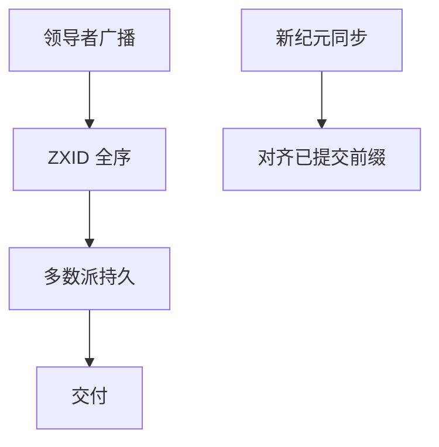

# Zab 与 ZooKeeper

Zab 给前缀一致的广播：同一纪元里领导者的事务全序，切换纪元时新主对齐已提交前缀。ZooKeeper 用它实现文件系统 API 的线性一致元数据。

<footer>—— 据 Hunt, Konar, Junqueira and Reed, ZooKeeper, USENIX ATC 2010；Junqueira, Reed and Serafini, Zab, DSN 2011 整理</footer>

上一课[Raft 成员与快照](/cs/raft-membership-snapshot)讲了日志上的配置。缺口是**另一条被广泛跑的日志协议**：ZooKeeper 不是 Raft 实现，它用 Zab。本课对照 RSM 形状，不重写 Raft 投票。后课 VR 更早，是第三条亲戚。

## 问题

Zab 保证：已交付的事务形成全序；新领导者恢复时，已提交前缀不丢、未达多数派的尾可丢。纪元（epoch）类似 term。发现与同步阶段选出领导者并补齐跟随者，广播阶段流水线事务。ZXID 高位纪元、低位计数，比较规则钉「更新的日志」。

ZooKeeper API：znode、watch、顺序节点。客户端会话带[租约](/cs/leases)式超时。写走领导者，读可走跟随者——默认读不是线性一致，`sync` 后读才追上。这是[会话](/cs/session-guarantees)与 RSM 的交界：产品把弱读当默认。

ATC 2010 讲服务；DSN 2011 讲 Zab。Chubby 用 Paxos，下一课再钉锁服务对照。

## 方法

写：领导者赋 ZXID，多数派持久后交付状态机。watch：对 znode 的一次性回调，不是总线级可靠订阅——丢失要靠版本再读。成员：集成在 ZooKeeper 自身，配置也是 znode 树的一部分加法定人数。

与 Raft：都是稳定主日志。Zab 强调广播原语的前缀性质；Raft 强调可理解的状态机与日志匹配。不要把二者当互为形式化翻译而不看提交规则差异。

## 机制

线性一致写：多数派 ack。线性一致读：读领导者或 sync。Chubby 风格的锁在 ZK 上用临时顺序节点实现——那是后课锁与 fencing 的例子，本课只指出 API 能做。脑裂：旧领导者纪元落后，写被拒。

本课不把 Kafka 早期「用 ZK 做控制器」当成 Zab 本身；那是客户端。也不把 ZK 当 CAP 的 AP 系统：它是 CP 元数据。

快照与滚动：ZK 有快照+事务日志，与 Raft 快照同族工程税。

## 边界

本课不写 watch 的所有边角、不引入 Zxid 溢出。后课默认：说到 ZK，日志是 Zab，读默认可旧，写走多数派。VR 下一课说明这些「主+日志」比 Paxos 论文更早出现在 Liskov 组。

前缀广播是 RSM 的投递层。API 把弱读暴露出去，不改变写路径的全序。

## 小结

- Zab：纪元 + ZXID 前缀一致广播。
- ZooKeeper 写线性一致；跟随者读默认可旧。
- 与 Raft 同族不同提交与恢复术语。
- 出处：Hunt et al., ATC 2010；Junqueira et al., DSN 2011。
