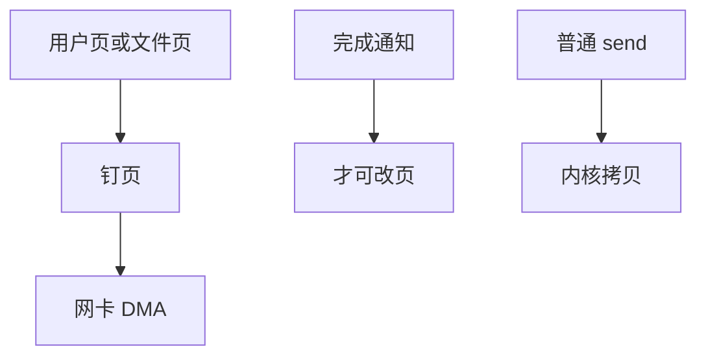

# 零拷贝网络

零拷贝让包数据只被 DMA 一次：MSG_ZEROCOPY、sendfile、AF_XDP umem 或包头仅线性拷贝，负载留在页上。

<footer>—— 据 Linux MSG_ZEROCOPY 文档；sendfile 实践；AF_XDP 对 umem 的说明</footer>

[sendfile](/cs/sendfile-splice) 已从文件侧减拷。[sk_buff](/cs/skbuff) 的 frags 是载体。[RSS](/cs/rss-multiqueue) 解决 CPU。缺口是 **网络零拷贝** 的几条路径与完成通知——不是绝对零。

## 问题

`send` 默认拷进 skb 线性区或内核页。`MSG_ZEROCOPY`：用户页钉住，协议用，完成用错误队列通知可改页。接收：`recvmmsg` 仍常拷；真正少拷是 mmap 包环、AF_XDP、或 GRO 后直接 splice 到文件。缺口：页必须对齐、不能立即重写；校验卸载与加密可能迫使拷贝。本课不把 TLS 内核卸载细节写完。

「零拷贝」统计上常是「少一次」。调试要用完成通知，否则数据竞争。与 O_DIRECT 同构：应用承担生命周期。

## 方法

发送静态文件：sendfile。发送用户缓冲：MSG_ZEROCOPY + 等 completion。接收旁路：AF_XDP 把 umem 填给驱动。对照 DPDK：全程用户 mbuf。对照 [mmap 文件](/cs/fs-mmap-coherence)：文件零拷贝与网络零拷贝可在 sendfile 汇合。

## 机制

零拷贝把 CPU memcpy 从数据面拿掉，瓶颈回到 DMA 与协议状态。它不取消 [套接字缓冲](/cs/socket-buffers) 的会计——记账仍按字节。不要写成网卡广告。与 XDP：XDP 改的是早处理，数据仍可在同一页上 TX。

失败回退到拷贝必须正确，否则静默损坏。

实现上：MSG_ZEROCOPY 的完成通知走错误队列，应用必须读，否则不能重用缓冲。页必须 page-aligned 且生命周期覆盖 DMA。校验与加密卸载失败会静默拷贝。 读法上只引用[上一课](/cs/rss-multiqueue)的结论，不把对象换成训练推理或限价簿。

本课在操作系统进阶的「网络栈 / 收发路径」课序里，对象是 **零拷贝网络**。

- 先修只引用，不重导：上一课的结论当公理，本课只补差。
- 五栏不吞并：不把本课写成大模型训练/推理，也不写成限价簿或权重量化。
- 文献用 OSTEP、McKusick、内核文档与具名会议论文；不发明 arXiv 编号。

## 边界

本课不引入所有 NIC 的 header-data split。不保证虚拟机 vhost 零拷贝与客户页的 IOMMU 映射总成功。下一课把「绕过 TCP 的传输」接到 OS：RDMA。

版本字段会变，课序钉的是机制对象「零拷贝网络」，不是某一主线内核的结构体名。
后课默认：发送路径可钉用户/文件页 DMA。RDMA 在 OS 中的队列对与内存注册，下一课。

## 小结

- 零拷贝靠钉页与 DMA，完成前不能改缓冲。
- sendfile、MSG_ZEROCOPY、AF_XDP 是不同接头。
- RDMA 是下一课。
- 出处：Linux `MSG_ZEROCOPY`；AF_XDP；sendfile。
