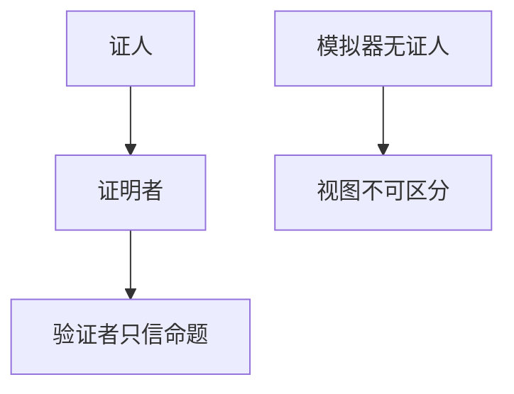

# 零知识直觉

证明者让验证者相信命题成立，而不多给能转述给第三人的证据。模拟器能在不知道证人时伪造与真实不可区分的对话——这就是「零知识」。

<footer>—— Goldwasser, Micali and Rackoff, The Knowledge Complexity of Interactive Proof Systems, 1985, 1989</footer>

## 定位

上一课[后量子](/cs/post-quantum-kyber)换了陷门。缺口是**另一类协议目标**：不传输证人，只传输可验的对话。主干没有 ZK 课；本课直觉，不写电路到多项式的全套。与[交互证明](/cs/interactive-proofs)的复杂度课只点名，不重推 IP=PSPACE。

后课默认已经读完本课钉下的合同，只补差，不从该领域第一性原理重开。

## 问题

签名证明「持有私钥的人认过消息」，但签名本身可转述。ZK：验证者自己能模拟视图，故不能拿对话去说服别人（在适当模型下）。缺口是完备性、可靠性、零知识三条，不是具体 zk-SNARK 产品。

### 可靠性≠零知识

可靠性：假命题不能过。零知识：真命题的对话不泄漏证人。可以强可靠而完全不零知识（直接给证人）。

GMR 1985/1989。Schnorr 协议是离散对数的经典 Σ 协议形状，本课只当例子点名，不给用于伪造的代数步骤。

## 方法

用「洞穴/口令」隐喻后立刻升到游戏：模拟器、提取器。指出非交互需要 Fiat–Shamir 与随机预言机假设。后课承诺是 Σ 协议的零件。

图中节点是本课的机制骨架；课程不把图展开成可运行的攻击步骤。

## 机制

ZK 服务「选择性披露」：我属于集合、我付过款、我知道原像——验证者不带走可转述的证书。它不替代 TLS，不替代 AEAD。计算成本高，协议要选陈述。

前提写进合同之后，游戏外的误用只当失败模式点名，不在本课写成操作程序。

## 边界

本课不写 Groth16 的配对细节，不把区块链当必经应用。下一课承诺与 Merkle 树：隐藏后可打开，以及把集合收成根。

## 小结

- KEM 换困难问题；ZK 换「证明而不给证人」。
- 完备、可靠、零知识三条分开。
- 模拟器测试零知识；转述性与签名不同。
- 下一课：承诺与 Merkle 树。
- 出处：Goldwasser, Micali and Rackoff, 1985/1989；对照 Goldreich。
