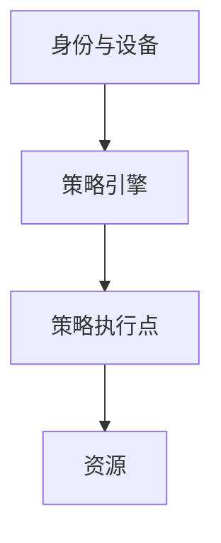

# 零信任架构

零信任架构把每请求的认证、授权与加密当默认，网络位置降为弱信号。策略引擎、身份、设备姿态组成控制平面。它是 NIST 的架构语言，不是某厂商产品名。

<footer>—— Rose et al., NIST SP 800-207</footer>

## 定位

上一课[风险量化](/cs/risk-quantification)要减情景。缺口是**架构**：前课[VPN 对零信任](/cs/vpn-zero-trust)已对照管道。本课收 SP 800-207 组件。

后课默认已经读完本课钉下的合同，只补差，不从该领域第一性原理重开。

## 问题

隐式信任区过大。缺口：PE/PA、持续评估、微分段。身份来自本课程身份单元。

### 遗留

不能一次关掉 VPN。迁移是并行控制。

SP 800-207。纵深防御下一课把多层写进同一画面。

## 方法

画控制平面与数据平面。下一课纵深防御。

图中节点是本课的机制骨架；课程不把图展开成可运行的攻击步骤。

## 机制

请求级授权。纵深下一课强调仍要多层，零信任不是单层银弹。

前提写进合同之后，游戏外的误用只当失败模式点名，不在本课写成操作程序。

## 边界

不写厂商对照表。纵深防御下一课。

## 小结

- 量化指出隐式信任贵；零信任改默认。
- 策略引擎每请求评估。
- 位置弱信号；身份单元零件接上。
- 下一课纵深防御。
- 出处：NIST SP 800-207；[vpn-zero-trust](/cs/vpn-zero-trust)。
