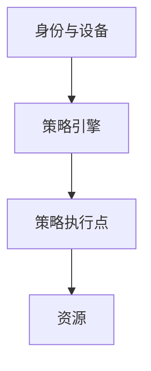

# 零信任架构

零信任架构把每请求的认证、授权与加密当默认，网络位置降为弱信号。策略引擎、身份、设备姿态组成控制平面。它是 NIST 的架构语言，不是某厂商产品名。

<footer>—— Rose et al., NIST SP 800-207</footer>

上一课[风险量化](/cs/risk-quantification)要求削减情景；本课把缺口落到**架构**。前课[VPN 对零信任](/cs/vpn-zero-trust)已对照过「边界管道」的思维；这里把 SP 800-207 的组件收拢成一张图。

后课默认已经读完本课钉下的合同，只补差，不从该领域第一性原理重开。

## 问题

传统架构的毛病是隐式信任区过大：进了内网就像进了没有摄像头的后厨，横向移动无阻。缺口是三件事：策略引擎（PE）与策略执行点（PA）分离、对每个请求持续评估信任、把网络切成微分段限制爆炸半径。身份的零件——认证、令牌、设备姿态——来自本课程身份单元。

### 遗留

遗留系统关不掉也关不快：迁移的现实形态是并行控制——同一资源先由零信任策略与 VPN 双轨放行，再逐段收窄旧边界。

SP 800-207。纵深防御下一课把多层写进同一画面。

## 方法

方法是把控制平面与数据平面画开：策略引擎收集身份与设备姿态做每请求决策，策略执行点在数据路径上强制执行，决策经加密通道下发。设计次序是先列保护对象与访问关系、再放执行点，不是先买产品再找位置。下一课纵深防御。

```mermaid
flowchart TD
  ID["身份与设备"] --> PE["策略引擎"]
  PE --> PA["策略执行点"]
  PA --> RES["资源"]
```

## 机制

机制是请求级授权：会话内不再「一次登录终身可信」，每个请求重估身份、设备、行为与上下文，信任随风险动态衰减——令牌到期、步调异常都会压低评分。它防的是横向移动与边界内裸奔，但不是单层银弹：策略引擎本身是新的高价值单点，它的误判即全局误判。纵深下一课强调仍要多层。

## 边界

不写厂商对照表；边界要点名：持续评估的信号（设备姿态、行为基线）可被对抗者投毒，而误报的代价是频繁重认证造成的用户疲劳——控制太烦会被用户自己绕掉。纵深防御下一课。

## 小结

- 量化指出隐式信任贵；零信任改默认。
- 策略引擎每请求评估。
- 位置弱信号；身份单元零件接上。
- 下一课纵深防御。
- 出处：NIST SP 800-207；[vpn-zero-trust](/cs/vpn-zero-trust)。
