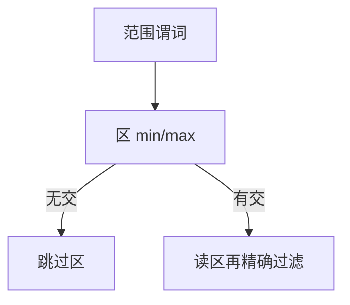

# zone map 与跳过索引

每个区记录 min/max 或粗过滤器；谓词与区无交则整区不读。这是统计，不是第二种 B+。

<footer>—— 据 Oracle Exadata storage index；C-Store / Vertica 分区统计；Parquet 页统计</footer>

[上一课](/cs/parquet-orc)在文件 footer 里放了统计。本课不背 Thrift 字段。缺口是库内表同样需要**跳过**：按块、按分区、按 row group 维护 zone map（区图）。选择率低且数据按谓词列部分有序或聚簇时，跳过极狠；随机值则 min/max 覆盖全域，等于没索引。

## 问题

B+ 精确定位键。zone map 只回答「这个 8MB 里有没有可能命中」。假阳性（区说可能有，实际没有）会多读；不应有假阴性（说没有却有）。缺口是维护：插入更新要调整 min/max；删除可能使 min 过时（仍安全，只是少跳过）或需重算。

与布隆：布隆服务等值「不在集合」；zone map 服务范围与比较。可同时存在。与直方图：直方图给优化器基数；zone map 给执行器跳 I/O。两者都是摘要，用途不同。

存储索引、small materialized aggregates、minmax 块索引是同一族。数据按时间插入则时间列 zone map 近乎分区裁剪。无序 UUID 列上 zone map 几乎无用。

## 方法

粒度：页、extent、分区、row group。谓词下推到扫描：比较 zone 与常量。复合谓词：各列 zone 分别裁，AND 收紧。分区表：分区约束是声明的 zone（后课表分区）。

写入：原地更新若缩小值域仍可只放宽 min/max（保守）。VACUUM 后重建更紧。

## 机制

向量化扫描前先丢区。并行工人按仍可能命中的区划分，避免空工人。优化器可用 zone 改善估计，但过期 zone 导致计划仍扫——执行仍会跳，估计与执行不一致又是回归源。

LSM：SST 的 key range 是一种 zone；块内 min/max 更细。

## 边界

本课不讲位图索引的逐值精确。也不把学习索引的模型当 zone。跳过失败不是 bug，是摘要粒度。

后课默认：扫描带 zone 裁剪；无序列不要指望 min/max。位图索引：低 NDV 列上精确存在测试，补 zone 的「可能」。

Zone 是执行侧过滤器，不是候选键。

## 小结

- zone map 用 min/max 等摘要跳过不可能命中的区。
- 维护偏保守；无序列收益低。
- 位图索引下一课：低基数列的精确位向量。
- 出处：storage index 实践；C-Store；列文件统计。
