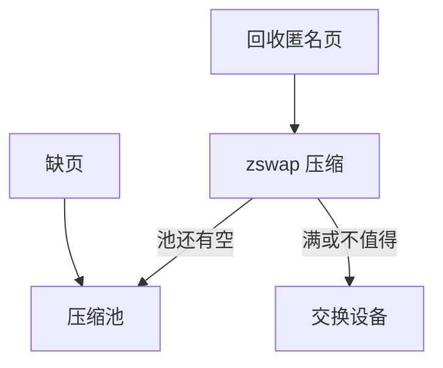

# zswap

zswap 在页被换出到盘之前先压缩进内存池：命中则解压回，池满再真正写交换设备。

<footer>—— 据 Linux zswap 文档；zbud/zsmalloc 分配器说明</footer>

[KSM](/cs/ksm) 去重仍在「未换出」的世界。内存仍紧则走交换。[writeback](/cs/writeback) 对文件页；匿名页走 swap。缺口是 **zswap**：用 CPU 压缩换磁盘 I/O。不是 zram 整盘当 swap 的同一实例，但亲戚。

## 问题

SSD 再快，压缩 4K 到 1K 并留在 RAM 往往更低延迟。zswap：frontswap 钩，换出时压缩，键是 swap 槽。缺口：压缩算法、池大小、拒绝（incompressible）；与 [memcg](/cs/memcg) 的交换会计；和 zram 的差别——zram 是块设备，zswap 是交换路径缓存。本课不把每个 compressor 基准写成附录。

同页再次换入命中 zswap 则不读盘。写回：池满按 LRU 把压缩页解开或直接写 swap（视实现）。

## 方法

`pageout`：尝试 zswap store，成功则不立即发 bio。`pagein`：load 解压。对照 [bcache](/cs/bcache)：一个缓存块设备，一个缓存交换页。对照 THP：大页通常先拆再进 zswap。

## 机制

zswap 把交换从「必定盘 I/O」变成「先 CPU 再盘」，改善超售。它消耗 CPU 与不可移动的压缩池，可能妨碍 [compaction](/cs/page-migration-compaction)。不要写成云内存产品。与 [O_DIRECT](/cs/direct-io) 无关。

安全：压缩数据仍是明文，在 RAM 里。

实现上：不可压缩页浪费一次压缩尝试。zsmalloc 的对象不可直接 DMA，换入要先解压到正规页。与 zram 同时用会双重压缩，通常选一个。 读法上只引用[上一课](/cs/ksm)的结论，不把对象换成训练推理或限价簿。

本课在操作系统进阶的「内存进阶 / 回收、迁移与加固」课序里，对象是 **zswap**。

- 先修只引用，不重导：上一课的结论当公理，本课只补差。
- 五栏不吞并：不把本课写成大模型训练/推理，也不写成限价簿或权重量化。
- 文献用 OSTEP、McKusick、内核文档与具名会议论文；不发明 arXiv 编号。

## 边界

本课不引入 zswap 的 writeback 策略全部 sysfs。不保证实时负载该开。下一课把页放到哪一节点：NUMA 内存策略。

版本字段会变，课序钉的是机制对象「zswap」，不是某一主线内核的结构体名。
后课默认：换出路径可压缩缓存。进程如何绑定节点与交错，下一课 mempolicy。

## 小结

- zswap 压缩即将换出的匿名页，减少盘 I/O。
- 池与 CPU 是税；zram 是另一形态。
- NUMA 策略是下一课。
- 出处：Linux zswap；frontswap；Gorman 交换背景。
