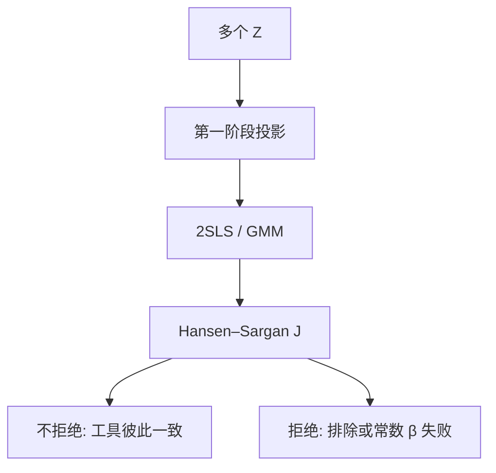

# 2SLS 与过度识别

多个工具时，两阶段最小二乘把第一阶段拟合成最优线性组合；过度识别检验问的是这些工具是否指向同一个 $\beta$，不是单条排除已经证实。

<footer>—— Theil 2SLS；Sargan, The Estimation of Economic Relationships Using Instrumental Variables, Econometrica 1958；Hansen, Large Sample Properties of Generalized Method of Moments, Econometrica 1982</footer>

[上一课](/econ/iv-weak-instruments)在恰好识别下写出 Wald 比，并警告弱工具。本课缺口是多个 $Z$：2SLS 如何加权，以及过度识别（overid）能检验什么、不能检验什么。[GMM](/econ/gmm-econ)下一课把矩条件写清；准实验更后再换设计。

## 问题

$X$ 内生，$Z$ 是 $L\times 1$，$L>1$。每个工具单独给一个 IV 估计，一般不一致（有限样本更不用说）。2SLS：第一阶段用全部 $Z$（加外生控制）拟合 $\hat X$，第二阶段 $Y$ 对 $\hat X$ 回归。它等价于 GMM 在同方差下用最优权重。缺口是：若各 $Z$ 的 LATE 不同，2SLS 估的是工具特定权重的混合，过度识别拒绝可能是异质而不是「内生」。

Sargan / Hansen $J$：过度识别约束的二次型。不拒绝不能证明排除成立——只是工具之间的隐含 $\beta$ 够接近。拒绝则要么排除失败，要么模型（常数 $\beta$、线性）错。

恰好识别时 $J$ 没有自由度，排除仍不可检验。过度识别检验的是工具之间的一致性，不是与「真排除」的距离。

## 方法

记 $P_Z$ 为 $Z$ 上的投影。2SLS $= (X'P_Z X)^{-1}X'P_Z Y$。LIML 在弱工具与多工具时偏误往往小于 2SLS；Fuller 修正是常用稳健变体。异方差下用 Hansen $J$ 而不是 Sargan。聚类时权重与 $J$ 都要换成聚类协方差。

弱工具加多工具：2SLS 有限样本偏向 OLS 更明显。诊断仍用第一阶段（Kleibergen–Paap）、Anderson–Rubin、条件 LR，不要只报 2SLS 点估计。

## 机制

机制是把 $Z$ 张成的外生变异投影到 $X$ 上，再用这段预测值当「清洗过的回归元」。同方差时，这个线性组合在 IV 类中渐近有效。异质 LATE 下，每个 $Z$ 对应不同编译器群体，2SLS 权重由第一阶段拟合给出——与 ATE 无必然关系。$J$ 拒绝可以是「义务教育季度与学费减免推动的不是同一群人」。

与上一课弱工具：工具很多但每个都弱，$J$ 的名义水平也会坏。先强度、再过度识别，顺序不要倒。

Hansen 1982 的 GMM 把 2SLS 放进矩条件：$\mathbb{E}[Z u]=0$。最优权重是 $Zu$ 的协方差之逆。$J$ 是过度约束的 GMM 目标函数值。

## 边界

本课不把 $J$ 的 $p>0.05$ 写成论文的识别证明。不引入三阶段、控制函数的完整菜单——离散内生下一单元再写。量化栏公司金融里「滞后工具」常弱且排除可疑，本课只给语言，不重做那些表。下一课 GMM 把 2SLS 收进矩；准实验更后才把识别换成时间上的政策差。

后课默认：多个工具时报告 2SLS / LIML、第一阶段、以及 $J$ 的解释（异质对排除）。不要把过度识别当成恰好识别排除的替代证明。

## 小结

- 2SLS = 用 $Z$ 投影清洗 $X$；同方差 GMM 的特例。
- $J$ 检验工具之间是否指向同一 $\beta$，不证实单条排除。
- 异质 LATE 下拒绝可以是权重不同，不是一定「工具坏了」。
- 弱加多工具：优先 LIML / AR，而不是堆 $Z$。
- 出处：Theil 2SLS；Sargan, *Econometrica* 1958；Hansen, *Econometrica* 1982；Angrist and Pischke, *Mostly Harmless*。
